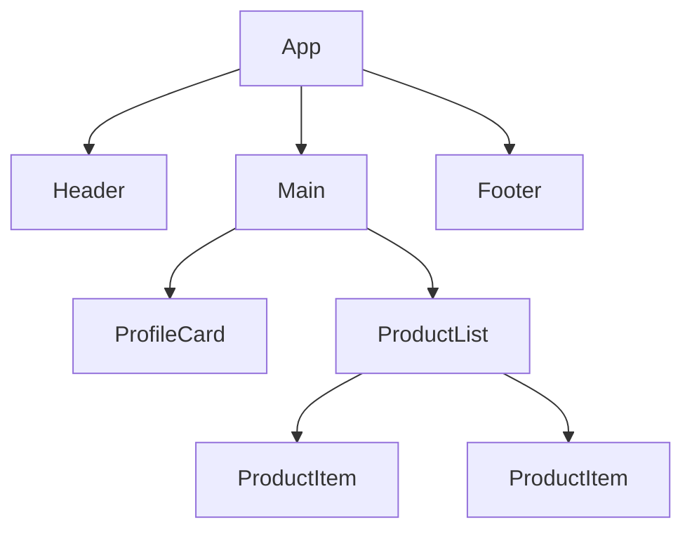
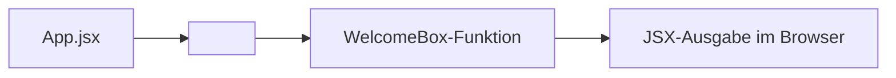

###### Themen

Erste React-Komponenten

- Was ist eine Komponente?
- Aufbau einer funktionalen Komponente
- Komponenten in Dateien organisieren
- Eine erste eigene Komponente erstellen und einbinden

JSX Verständnis

- Was ist JSX?
- JSX-Syntax im Vergleich zu HTML
- Dynamische Inhalte mit geschweiften Klammern
- Häufige Anfängerfehler in JSX


# 🧩 Erste React-Komponenten

Eine **Komponente** ist in React ein eigener, wiederverwendbarer Baustein der Benutzeroberfläche. React beschreibt Komponenten als Elemente, mit denen du **Markup**, **Logik** und oft auch **Verhalten** an einer Stelle zusammenfasst, damit du Oberflächen besser strukturieren und mehrfach verwenden kannst ([Your First Component](https://react.dev/learn/your-first-component)).

Stell dir eine App wie ein Haus aus Lego vor. Du baust nicht das ganze Haus als einen einzigen riesigen Block, sondern aus kleineren Teilen: Fenster, Türen, Dach, Wände. In React sind genau solche Teile die Komponenten. Ein Button kann eine Komponente sein, eine Navigationsleiste kann eine Komponente sein, eine Produktkarte kann eine Komponente sein, und sogar eine ganze Seite kann aus mehreren Komponenten zusammengesetzt sein.

Der große Vorteil ist: Du musst Dinge nicht ständig neu schreiben. Wenn du zum Beispiel eine `UserCard`-Komponente gebaut hast, kannst du sie an vielen Stellen verwenden. Du änderst dann später nur diese eine Komponente, und alle Stellen profitieren davon. Genau dadurch bleiben React-Projekte übersichtlicher und wartbarer.

Außerdem denkt React die Benutzeroberfläche als **Komponentenbaum**. Das bedeutet: Eine Hauptkomponente enthält andere Komponenten, diese enthalten wieder weitere Komponenten, und so weiter. Die Oberfläche ist also nicht einfach nur „eine Datei mit viel HTML“, sondern ein sauber gegliedertes System aus Bausteinen ([Understanding Your UI as a Tree](https://react.dev/learn/understanding-your-ui-as-a-tree)).



In der Praxis bedeutet das: Wenn du eine React-App ansiehst, solltest du dir immer die Frage stellen: **Welche Teile der Oberfläche wiederholen sich oder gehören logisch zusammen?** Genau diese Teile sind oft gute Kandidaten für eigene Komponenten.


<br><br><br>
## ❓ Was ist eine Komponente?

Technisch gesehen ist eine React-Komponente meistens einfach eine **JavaScript-Funktion**, die **JSX zurückgibt**. JSX ist die Schreibweise, mit der du beschreibst, wie die Oberfläche aussehen soll. React ruft diese Funktion auf und erzeugt daraus die sichtbare Ausgabe im Browser ([Your First Component](https://react.dev/learn/your-first-component)).

Eine sehr einfache Komponente sieht so aus:

```jsx
function Greeting() {
  return <h1>Hallo!</h1>;
}
```

Hier passiert Folgendes:

- `function Greeting()` definiert eine Funktion.
- Der Name beginnt mit einem **Großbuchstaben**.
- `return <h1>Hallo!</h1>;` liefert das zurück, was React anzeigen soll.

Warum der Großbuchstabe wichtig ist: In JSX behandelt React **kleingeschriebene Tags** wie normale HTML-Tags, also zum Beispiel `<div>` oder `<section>`. Ein Name mit Großbuchstaben wie `<Greeting />` wird dagegen als **eigene React-Komponente** erkannt ([Your First Component](https://react.dev/learn/your-first-component)).

Eine Komponente kann sehr klein sein, zum Beispiel nur ein einzelner Textblock. Sie kann aber auch komplexer sein und andere Komponenten zusammensetzen. Wichtig ist vor allem: Eine Komponente beschreibt einen klar abgegrenzten Teil der Oberfläche.

Wenn du also fragst: „Was ist eine Komponente?“ dann ist die einfachste und zugleich fachlich richtige Antwort:

> Eine Komponente ist eine Funktion, die beschreibt, wie ein Teil deiner Benutzeroberfläche aussehen soll.

Oft steckt in einer Komponente später noch mehr:

- **Daten** über `props`
- **Zustand** über `useState`
- **Effekte** über `useEffect`
- **Event-Handling** wie Klicks oder Eingaben

Für den Einstieg reicht aber: Eine Komponente ist zunächst ein wiederverwendbarer UI-Baustein.


<br><br><br>
## 🏗️ Aufbau einer funktionalen Komponente

In modernen React-Projekten arbeitest du fast immer mit **funktionalen Komponenten**. Das ist heute der Standard. React zeigt in den aktuellen Lernunterlagen Komponenten ebenfalls als Funktionen ([Your First Component](https://react.dev/learn/your-first-component)).

Eine funktionale Komponente hat typischerweise diesen Grundaufbau:

```jsx
function ComponentName() {
  return (
    <div>
      Inhalt
    </div>
  );
}
```

Schauen wir uns die einzelnen Teile genau an.

### 🔤 Der Name der Komponente

Der Name muss mit einem **Großbuchstaben** anfangen:

```jsx
function WelcomeMessage() {
  return <h1>Willkommen!</h1>;
}
```

Das ist wichtig, weil React sonst denkt, es handelt sich um ein normales HTML-Element.

### 🔁 Die Rückgabe mit `return`

Die Funktion muss etwas zurückgeben, normalerweise JSX:

```jsx
function WelcomeMessage() {
  return <h1>Willkommen!</h1>;
}
```

Wenn du nichts zurückgibst, kann React auch nichts anzeigen. Gerade am Anfang ist das ein häufiger Fehler.

### 🧱 JSX als Ausgabe

Das, was im `return` steht, ist meistens JSX. JSX sieht HTML ähnlich, ist aber keine reine HTML-Datei, sondern Teil von JavaScript ([Writing Markup with JSX](https://react.dev/learn/writing-markup-with-jsx)).

```jsx
function WelcomeMessage() {
  return (
    <section>
      <h1>Willkommen!</h1>
      <p>Schön, dass du da bist.</p>
    </section>
  );
}
```

### 📦 Eine Komponente kann andere Komponenten verwenden

React wird besonders stark, wenn du Komponenten miteinander kombinierst:

```jsx
function Title() {
  return <h1>Mein Profil</h1>;
}

function ProfilePage() {
  return (
    <section>
      <Title />
      <p>Hier stehen die Profildaten.</p>
    </section>
  );
}
```

Hier wird `Title` innerhalb von `ProfilePage` eingebunden. Das ist ein zentrales Prinzip in React: **Komposition**. Du baust große Oberflächen aus kleineren Teilen zusammen.

### 🧾 Häufige Grundform mit Export

In echten Projekten liegt eine Komponente oft in einer eigenen Datei. Dann exportierst du sie:

```jsx
export default function WelcomeMessage() {
  return <h1>Willkommen!</h1>;
}
```

Das `export default` bedeutet: Diese Komponente ist der Hauptinhalt der Datei und kann in anderen Dateien importiert werden ([Importing and Exporting Components](https://react.dev/learn/importing-and-exporting-components)).

### 📌 Wichtige Regeln für den Anfang

| Teil | Bedeutung |
|---|---|
| `function Name()` | Definiert die Komponente |
| Großbuchstabe | Kennzeichnet sie als React-Komponente |
| `return (...)` | Gibt die UI zurück |
| JSX | Beschreibt die Oberfläche |
| `export` | Macht die Komponente in anderen Dateien nutzbar |

Eine funktionale Komponente ist also konzeptionell einfach: **Name + Funktion + JSX-Rückgabe**. Alles Weitere baut darauf auf.


<br><br><br>
## 🗂️ Komponenten in Dateien organisieren

React zwingt dich nicht zu einer festen Ordnerstruktur. Du kannst theoretisch viele Komponenten in eine Datei schreiben. In der Praxis wird das aber schnell unübersichtlich. Deshalb ist es üblich, Komponenten sinnvoll auf Dateien zu verteilen und sie per `import` und `export` miteinander zu verbinden ([Importing and Exporting Components](https://react.dev/learn/importing-and-exporting-components)).

Ein typischer Projektaufbau könnte so aussehen:

```text
src/
  App.jsx
  main.jsx
  components/
    Header.jsx
    UserCard.jsx
    Button.jsx
```

Die Idee dahinter ist einfach:

- `App.jsx` ist oft die Hauptkomponente.
- Im Ordner `components` liegen wiederverwendbare UI-Bausteine.
- `main.jsx` ist meistens der Einstiegspunkt, an dem React in das HTML eingebunden wird.

### 📄 Eine Komponente pro Datei

Sehr häufig schreibt man **eine Hauptkomponente pro Datei**. Das macht den Code leichter lesbar.

`src/components/UserCard.jsx`

```jsx
export default function UserCard() {
  return (
    <article>
      <h2>Max Mustermann</h2>
      <p>Frontend-Entwickler</p>
    </article>
  );
}
```

In `App.jsx` kannst du sie dann importieren:

```jsx
import UserCard from './components/UserCard';

export default function App() {
  return (
    <main>
      <h1>Meine App</h1>
      <UserCard />
    </main>
  );
}
```

Das ist eines der wichtigsten Grundmuster in React: **Komponente auslagern, exportieren, importieren, verwenden**.

### 📤 `export default` und Import

Wenn du `export default` nutzt, importierst du die Komponente ohne geschweifte Klammern:

```jsx
export default function Header() {
  return <h1>Header</h1>;
}
```

Import:

```jsx
import Header from './components/Header';
```

Es gibt auch **benannte Exporte**, aber für den Einstieg ist `export default` oft leichter verständlich.

### 🧭 Sinnvolle Organisation nach Verantwortung

Komponenten solltest du nicht nur „irgendwo“ speichern, sondern nach ihrer Aufgabe sortieren. Zum Beispiel:

- `components/ui/` für sehr allgemeine UI-Bausteine wie Buttons oder Karten
- `components/layout/` für Seitenstruktur wie Header, Sidebar, Footer
- `components/profile/` für fachlich zusammengehörige Profilelemente

Gerade am Anfang reicht aber meistens schon ein einfacher `components`-Ordner völlig aus.

### 🧠 Warum gute Dateiorganisation wichtig ist

Je größer ein Projekt wird, desto wichtiger wird Struktur. Saubere Dateiorganisation hilft dir dabei,

- schneller Komponenten zu finden,
- Wiederverwendung zu erkennen,
- große Dateien zu vermeiden,
- Teamarbeit zu erleichtern.

React selbst lebt stark davon, dass du dein Interface in kleine, verständliche Einheiten zerlegst. Eine gute Dateistruktur unterstützt genau dieses Denken.


<br><br><br>
## 🛠️ Eine erste eigene Komponente erstellen und einbinden

Jetzt schauen wir uns den kompletten Weg an: von der Idee bis zur eingebundenen Komponente.

Stell dir vor, du möchtest in deiner App eine kleine Begrüßung anzeigen. Dann kannst du eine eigene Komponente anlegen.

### 📁 Schritt 1: Eine neue Datei anlegen

Zum Beispiel:

```text
src/components/WelcomeBox.jsx
```

### ✍️ Schritt 2: Die Komponente schreiben

```jsx
export default function WelcomeBox() {
  return (
    <section>
      <h2>Willkommen in meiner React-App</h2>
      <p>Das ist meine erste eigene Komponente.</p>
    </section>
  );
}
```

Hier definierst du eine Funktion namens `WelcomeBox`, gibst JSX zurück und exportierst sie direkt als Standard-Export.

### 🔌 Schritt 3: Die Komponente in `App.jsx` einbinden

```jsx
import WelcomeBox from './components/WelcomeBox';

export default function App() {
  return (
    <main>
      <h1>Startseite</h1>
      <WelcomeBox />
    </main>
  );
}
```

Jetzt wird `WelcomeBox` in `App` verwendet. Genau so benutzt du in React eigene Komponenten: **wie HTML-Tags, aber mit Großbuchstaben**.

### 👀 Was React dabei macht

Wenn React `<WelcomeBox />` sieht, führt es intern die Funktion `WelcomeBox()` aus und verwendet das zurückgegebene JSX für die Anzeige. Das ist der Kern der Komponentenlogik ([Your First Component](https://react.dev/learn/your-first-component)).



### 🧱 Komplettes Mini-Beispiel

`src/components/InfoCard.jsx`

```jsx
export default function InfoCard() {
  return (
    <article>
      <h2>React 19</h2>
      <p>Komponenten sind die Grundlage deiner Oberfläche.</p>
    </article>
  );
}
```

`src/App.jsx`

```jsx
import InfoCard from './components/InfoCard';

export default function App() {
  return (
    <main>
      <h1>Meine erste React-App</h1>
      <InfoCard />
    </main>
  );
}
```

### ⚠️ Typische Stolperstellen beim Erstellen

Wenn deine Komponente nicht angezeigt wird, liegen die Ursachen am Anfang oft an sehr einfachen Dingen:

| Problem | Falsches Beispiel | Richtiges Beispiel | Warum? |
|---|---|---|---|
| Name klein geschrieben | `function welcomeBox()` | `function WelcomeBox()` | React erkennt sonst keine Komponente |
| Falscher Importpfad | `./component/WelcomeBox` | `./components/WelcomeBox` | Der Pfad muss exakt stimmen |
| Kein Export | `function WelcomeBox() { ... }` | `export default function WelcomeBox() { ... }` | Sonst kann die Datei nicht importiert werden |
| Nicht als Tag verwendet | `WelcomeBox` | `<WelcomeBox />` | Komponenten werden in JSX als Elemente benutzt |
| Kein `return` | `function WelcomeBox() { <h1>Hi</h1> }` | `function WelcomeBox() { return <h1>Hi</h1>; }` | Ohne Rückgabe gibt es keine Ausgabe |

Wenn du dieses Grundprinzip verstanden hast, hast du bereits einen der wichtigsten Schritte in React gemeistert. Fast alles Weitere baut darauf auf: Props, Zustand, Events und Komposition.


<br><br><br>
# 🧾 JSX-Verständnis

JSX ist die Schreibweise, mit der React-Code oft so aussieht, als würdest du HTML direkt in JavaScript schreiben. Genau das macht React am Anfang so angenehm lesbar. Du beschreibst die Oberfläche dort, wo auch die Logik steht. React empfiehlt diesen Ansatz ausdrücklich, weil sich Markup und Logik in interaktiven Oberflächen oft eng aufeinander beziehen ([Writing Markup with JSX](https://react.dev/learn/writing-markup-with-jsx)).

Wichtig ist aber: JSX ist **nicht dasselbe wie HTML**. Es sieht nur sehr ähnlich aus. JSX ist letztlich eine **Syntax-Erweiterung für JavaScript**. Bevor der Browser den Code ausführen kann, wird JSX von Werkzeugen wie Vite, Babel oder vergleichbaren Build-Tools in normales JavaScript umgewandelt ([Writing Markup with JSX](https://react.dev/learn/writing-markup-with-jsx)).

Das bedeutet: Wenn du JSX schreibst, schreibst du nicht „eine HTML-Datei“, sondern du schreibst JavaScript-Code in einer besonders lesbaren Form. Genau deshalb gelten in JSX nicht nur HTML-Regeln, sondern auch JavaScript-Regeln.


<br><br><br>
## ❓ Was ist JSX?

JSX steht für **JavaScript XML**. Der Name zeigt schon, worum es geht: eine Schreibweise in JavaScript, die wie Markup aussieht. React verwendet JSX, damit du UI-Strukturen kompakt und verständlich formulieren kannst ([Writing Markup with JSX](https://react.dev/learn/writing-markup-with-jsx)).

Ein Beispiel:

```jsx
const element = <h1>Hallo Welt</h1>;
```

Das wirkt wie HTML, ist aber in Wirklichkeit JavaScript mit JSX-Syntax. React verarbeitet diese Schreibweise und erzeugt daraus die eigentlichen React-Elemente.

Warum JSX praktisch ist:

- Du siehst direkt, wie die Oberfläche aufgebaut ist.
- Logik und UI stehen nah beieinander.
- Dynamische Inhalte lassen sich leicht einfügen.
- Komponenten werden besser lesbar.

Ohne JSX wäre derselbe Gedanke deutlich sperriger. Du müsstest dann viele Funktionsaufrufe schreiben, anstatt die Struktur direkt zu sehen.

### 🧠 JSX ist Ausdruck, nicht Template-Datei

Ein häufiger Denkfehler am Anfang ist: „JSX ist doch einfach HTML in JavaScript.“ Ganz richtig ist das nicht. JSX ist eher ein **Ausdruck**, den du innerhalb von JavaScript verwenden kannst. Deshalb kannst du damit Variablen, Funktionsaufrufe oder Bedingungen kombinieren.

Zum Beispiel:

```jsx
const name = 'Mila';
const greeting = <h1>Hallo, {name}</h1>;
```

Hier wird JavaScript mit Markup verbunden. Genau das ist die Stärke von JSX.

### ⚙️ In modernen React-Projekten brauchst du meist kein `import React` mehr

Früher musste in jeder Datei mit JSX oft `import React from 'react'` stehen. Mit dem neuen JSX-Transform ist das in modernen Projekten normalerweise nicht mehr nötig, wenn dein Tooling entsprechend eingerichtet ist ([Introducing the New JSX Transform](https://legacy.reactjs.org/blog/2020/09/22/introducing-the-new-jsx-transform.html)). Das ist gerade in React-19-Projekten der Normalfall.

Das ist wichtig zu wissen, weil viele ältere Tutorials noch den alten Stil zeigen. Wenn du also in aktuellen Projekten JSX ohne manuelles React-Import siehst, ist das völlig normal.


<br><br><br>
## 🔄 JSX-Syntax im Vergleich zu HTML

JSX sieht HTML ähnlich, folgt aber in mehreren Punkten eigenen Regeln. React erklärt ausdrücklich, dass JSX „strenger“ als HTML ist und einige Bezeichner anders geschrieben werden müssen ([Writing Markup with JSX](https://react.dev/learn/writing-markup-with-jsx)).

Die wichtigsten Unterschiede siehst du hier:

| Thema | HTML | JSX |
|---|---|---|
| CSS-Klasse | `class="box"` | `className="box"` |
| Label für Formularfeld | `for="email"` | `htmlFor="email"` |
| Ereignisse | `onclick="..."` | `onClick={...}` |
| Mehrere Wörter in Attributen | oft kleingeschrieben | meist `camelCase`, z. B. `tabIndex` |
| Leere Elemente | `` | `` |
| Inline-Styles | Textstring | Objekt, z. B. `style={{ color: 'red' }}` |
| JavaScript im Markup | nicht direkt | mit `{ ... }` möglich |

### 🏷️ `className` statt `class`

In normalem HTML schreibst du:

```html
<div class="card"></div>
```

In JSX schreibst du:

```jsx
<div className="card"></div>
```

Der Grund ist, dass `class` in JavaScript ein reserviertes Wort ist. Deshalb verwendet React hier `className` ([Writing Markup with JSX](https://react.dev/learn/writing-markup-with-jsx)).

### 🏷️ `htmlFor` statt `for`

Im HTML kennzeichnet `for`, zu welchem Eingabefeld ein Label gehört. In JSX schreibst du stattdessen `htmlFor`:

```jsx
<label htmlFor="email">E-Mail</label>
<input id="email" type="email" />
```

Auch das hängt mit JavaScript-Bezeichnern zusammen.

### 🔒 Tags müssen sauber geschlossen werden

HTML ist an manchen Stellen sehr tolerant. JSX ist strenger. Ein Tag wie `` oder `<input>` muss in JSX sauber geschlossen werden:

```jsx

<input type="text" />
```

Wenn du das vergisst, bekommst du meist sofort eine Fehlermeldung vom Build-Tool oder Editor ([Writing Markup with JSX](https://react.dev/learn/writing-markup-with-jsx)).

### 📦 Mehrere Elemente brauchen einen gemeinsamen Elternknoten

In einer Komponente kannst du nicht einfach zwei nebeneinanderstehende Hauptelemente zurückgeben:

```jsx
// Falsch
return (
  <h1>Titel</h1>
  <p>Text</p>
);
```

Stattdessen brauchst du einen gemeinsamen Wrapper oder ein Fragment:

```jsx
return (
  <>
    <h1>Titel</h1>
    <p>Text</p>
  </>
);
```

Der Hintergrund ist, dass eine Komponente genau **einen** JSX-Wurzelknoten zurückgeben muss ([Writing Markup with JSX](https://react.dev/learn/writing-markup-with-jsx)).

### 🎨 Inline-Styles sind Objekte

In HTML würdest du vielleicht so etwas schreiben:

```html
<div style="color: red;"></div>
```

In JSX funktioniert das anders:

```jsx
<div style={{ color: 'red' }}></div>
```

Hier siehst du zwei Ebenen von geschweiften Klammern:

- die äußeren `{}` bedeuten: „Jetzt kommt JavaScript“
- die inneren `{ color: 'red' }` sind ein JavaScript-Objekt

Das ist anfangs ungewohnt, aber logisch, sobald du verstehst, dass JSX in JavaScript eingebettet ist.

### 🔤 Attributnamen oft in `camelCase`

Einige HTML-Attribute werden in JSX anders geschrieben, oft im `camelCase`-Stil:

```jsx
<input tabIndex={0} />
```

Statt einer HTML-ähnlichen Schreibweise orientiert sich JSX hier stärker an JavaScript-Konventionen.


<br><br><br>
## 🧠 Dynamische Inhalte mit geschweiften Klammern

Die geschweiften Klammern `{ ... }` sind eine der wichtigsten Ideen in JSX. Mit ihnen kannst du **JavaScript-Ausdrücke** direkt in dein JSX einbetten ([JavaScript in JSX with Curly Braces](https://react.dev/learn/javascript-in-jsx-with-curly-braces)).

Das bedeutet: Alles, was ein gültiger JavaScript-Ausdruck ist, kann in JSX innerhalb von `{}` stehen.

### 🔡 Einfache Variablen anzeigen

```jsx
export default function Greeting() {
  const name = 'Lea';

  return <h1>Hallo, {name}!</h1>;
}
```

`name` ist eine JavaScript-Variable. Durch `{name}` wird ihr Wert im JSX angezeigt.

### 🧮 Rechenausdrücke verwenden

```jsx
export default function MathExample() {
  const price = 10;
  const quantity = 3;

  return <p>Gesamtpreis: {price * quantity} €</p>;
}
```

Hier wird direkt im JSX gerechnet.

### 🧰 Funktionsaufrufe einbetten

```jsx
export default function UserInfo() {
  const user = 'maria';

  function formatName(name) {
    return name.toUpperCase();
  }

  return <p>Nutzer: {formatName(user)}</p>;
}
```

Auch Funktionsaufrufe sind erlaubt, solange sie einen Wert zurückgeben.

### ❓ Bedingungen mit dem ternären Operator

```jsx
export default function Status() {
  const isOnline = true;

  return <p>{isOnline ? 'Online' : 'Offline'}</p>;
}
```

Das ist wichtig: In JSX kannst du keine kompletten `if`-Anweisungen direkt mitten in den Markup-Text schreiben, aber du kannst **Ausdrücke** verwenden, zum Beispiel den ternären Operator oder logische Verknüpfungen.

### 🧾 Listen dynamisch darstellen

Ein sehr typischer Einsatz von `{}` ist das Rendern von Listen:

```jsx
export default function FruitList() {
  const fruits = ['Apfel', 'Banane', 'Mango'];

  return (
    <ul>
      {fruits.map((fruit) => (
        <li key={fruit}>{fruit}</li>
      ))}
    </ul>
  );
}
```

Hier passiert viel auf einmal:

- `fruits` ist ein JavaScript-Array
- `map()` erzeugt aus jedem Eintrag JSX
- das Ergebnis wird in die Liste eingesetzt
- `key` hilft React, einzelne Listenelemente zu unterscheiden ([Rendering Lists](https://react.dev/learn/rendering-lists))

### 🏷️ Geschweifte Klammern auch in Attributen

Du kannst `{}` nicht nur zwischen Tags, sondern auch bei Attributwerten verwenden:

```jsx
export default function Avatar() {
  const imageUrl = '/avatar.png';
  const altText = 'Profilbild';

  return ;
}
```

Hier werden `src` und `alt` dynamisch mit Variablen befüllt.

### 🎨 Das Spezialbeispiel `style={{ ... }}`

Dieses Muster verwirrt viele Anfänger:

```jsx
<div style={{ color: 'tomato', fontSize: '20px' }}>
  Text
</div>
```

Warum zwei geschweifte Klammern?

- Die äußeren Klammern sagen: „Hier kommt JavaScript.“
- Die inneren Klammern sind das Objekt mit den CSS-Eigenschaften.

### 🚫 Was in `{}` nicht funktioniert

Nicht alles ist erlaubt. In JSX dürfen in geschweiften Klammern **Ausdrücke**, aber keine beliebigen **Anweisungen** stehen ([JavaScript in JSX with Curly Braces](https://react.dev/learn/javascript-in-jsx-with-curly-braces)).

| Erlaubt in `{}` | Nicht direkt erlaubt in `{}` |
|---|---|
| `name` | `if (...) { ... }` |
| `price * 2` | `for (...) { ... }` |
| `isOpen ? 'Ja' : 'Nein'` | `const x = 5` |
| `items.map(...)` | mehrere Anweisungen mit Blocklogik |

Wenn du komplexere Logik brauchst, schreibst du sie meist **vor** dem `return` in normales JavaScript und verwendest das Ergebnis dann im JSX.


<br><br><br>
## ⚠️ Häufige Anfängerfehler in JSX

Gerade am Anfang entstehen Fehler in JSX oft nicht wegen komplizierter Logik, sondern wegen kleiner Syntax-Regeln. JSX ist gut lesbar, aber auch strenger als normales HTML ([Writing Markup with JSX](https://react.dev/learn/writing-markup-with-jsx)).

### 🔠 Komponentennamen klein schreiben

Wenn du eine eigene Komponente klein schreibst, behandelt React sie wie ein normales HTML-Tag.

```jsx
function profileCard() {
  return <h2>Profil</h2>;
}

// Falsch verwendet
<profileCard />
```

Richtig ist:

```jsx
function ProfileCard() {
  return <h2>Profil</h2>;
}

<ProfileCard />
```

Eigene Komponenten beginnen also immer mit einem Großbuchstaben ([Your First Component](https://react.dev/learn/your-first-component)).

### 🧱 Mehrere Wurzelelemente ohne Wrapper zurückgeben

```jsx
// Falsch
function App() {
  return (
    <h1>Titel</h1>
    <p>Text</p>
  );
}
```

Richtig:

```jsx
function App() {
  return (
    <>
      <h1>Titel</h1>
      <p>Text</p>
    </>
  );
}
```

Oder mit einem `div` bzw. `section` als gemeinsamen Container.

### 🏷️ `class` statt `className` schreiben

```jsx
// Falsch
<div class="box">Inhalt</div>
```

```jsx
// Richtig
<div className="box">Inhalt</div>
```

Das ist einer der klassischsten Anfängerfehler in JSX.

### 🔒 Tags nicht schließen

```jsx
// Falsch

```

```jsx
// Richtig

```

JSX verlangt sauber geschlossene Tags. Das betrifft besonders `img`, `input`, `br`, `hr` und ähnliche Elemente ([Writing Markup with JSX](https://react.dev/learn/writing-markup-with-jsx)).

### 🧠 Normale JavaScript-Anweisungen direkt ins JSX schreiben

```jsx
// Falsch
return (
  <div>
    {if (isLoggedIn) { 'Willkommen' }}
  </div>
);
```

Das funktioniert nicht, weil `if` eine Anweisung ist, kein Ausdruck. Richtig wäre zum Beispiel:

```jsx
return (
  <div>
    {isLoggedIn ? 'Willkommen' : 'Bitte einloggen'}
  </div>
);
```

Oder du bereitest die Logik vorher auf:

```jsx
let message = 'Bitte einloggen';

if (isLoggedIn) {
  message = 'Willkommen';
}

return <div>{message}</div>;
```

### 📦 Ein Objekt direkt rendern wollen

```jsx
const user = { name: 'Lina' };

// Falsch
return <p>{user}</p>;
```

Ein normales Objekt kann React nicht sinnvoll als Text darstellen. Stattdessen musst du auf eine konkrete Eigenschaft zugreifen:

```jsx
return <p>{user.name}</p>;
```

Gerade bei API-Daten passiert dieser Fehler häufig.

### 🎨 Inline-Styles wie in HTML schreiben

```jsx
// Falsch
<div style="color: red;">Text</div>
```

```jsx
// Richtig
<div style={{ color: 'red' }}>Text</div>
```

Hier vermischen Anfänger oft HTML-Denken mit JSX-Regeln.

### ↩️ `return` vergessen oder falsch umbrechen

Ein sehr häufiger Fehler bei funktionalen Komponenten ist, dass JSX zwar geschrieben wird, aber nicht wirklich zurückgegeben wird.

```jsx
// Falsch
function Hello() {
  <h1>Hallo</h1>;
}
```

Hier fehlt `return`.

Richtig:

```jsx
function Hello() {
  return <h1>Hallo</h1>;
}
```

Ein weiterer Stolperstein ist dieser Fall:

```jsx
// Problematisch
function Hello() {
  return
    <h1>Hallo</h1>;
}
```

JavaScript kann hier nach `return` bereits automatisch das Statement beenden. Deshalb setzt man JSX nach `return` am besten direkt dahinter oder in Klammern:

```jsx
function Hello() {
  return (
    <h1>Hallo</h1>
  );
}
```

### 🖱️ Event-Handler falsch übergeben

Auch das ist bei JSX sehr häufig:

```jsx
// Problematisch: wird sofort ausgeführt
<button onClick={handleClick()}>Klick mich</button>
```

Oft willst du die Funktion nicht sofort ausführen, sondern nur übergeben:

```jsx
<button onClick={handleClick}>Klick mich</button>
```

JSX erwartet bei `onClick` einen JavaScript-Ausdruck, der eine Funktion liefert. Wenn du `handleClick()` schreibst, rufst du sie sofort auf. React erklärt die Übergabe von Event-Handlern genauso in den Event-Grundlagen ([Responding to Events](https://react.dev/learn/responding-to-events)).

### 📋 Die wichtigsten Anfängerfehler auf einen Blick

| Fehler | Warum problematisch | Korrekte Form |
|---|---|---|
| `<myComponent />` | wird als HTML-Tag interpretiert | `<MyComponent />` |
| `class="box"` | JSX verwendet andere Attributnamen | `className="box"` |
| `` | Tag nicht geschlossen | `` |
| zwei Hauptelemente nebeneinander | nur ein Wurzelelement erlaubt | Wrapper oder `<>...</>` |
| `{if (...) { ... }}` | `if` ist kein Ausdruck | Ternär, `&&` oder Logik vor `return` |
| `{user}` bei Objekt | Objekt nicht direkt renderbar | `{user.name}` |
| `style="color:red"` | Stil erwartet Objekt | `style={{ color: 'red' }}` |
| `onClick={handleClick()}` | Funktion wird sofort ausgeführt | `onClick={handleClick}` |

Wenn du diese Fehlerbilder einmal verinnerlicht hast, wirst du JSX deutlich sicherer schreiben. Die meisten Startprobleme in React sind keine „React-Magie“, sondern einfach Regeln dieser speziellen Schreibweise.
