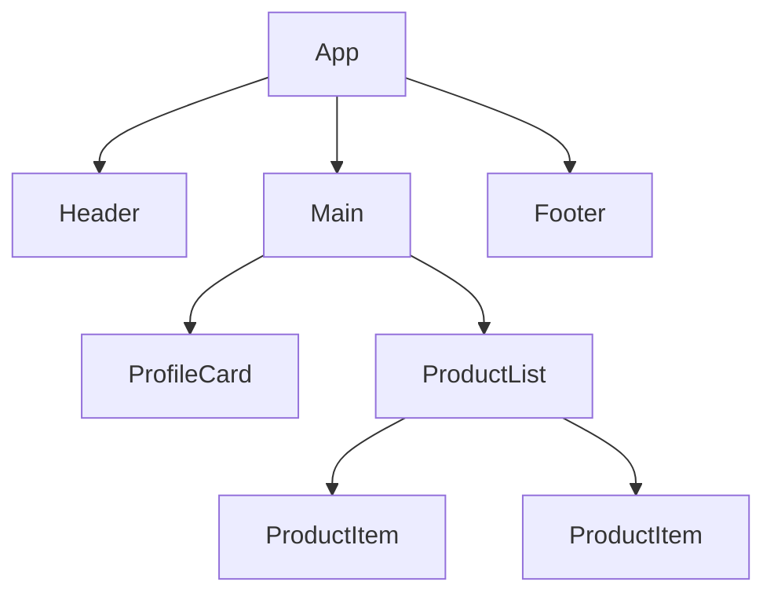
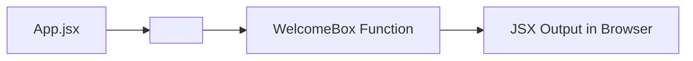

###### Topics

First React Components

- What is a component?
- Structure of a functional component
- Organizing components in files
- Create and import your first custom component

JSX Understanding

- What is JSX?
- JSX syntax compared to HTML
- Dynamic content with curly braces
- Common beginner mistakes in JSX

# 🧩 First React Components

A **component** in React is a distinct, reusable building block of the user interface. React describes components as elements that let you **combine markup**, **logic**, and often **behavior** in one place, so you can structure and reuse UIs more effectively ([Your First Component](https://react.dev/learn/your-first-component)).

Imagine an app as a house made of Lego. You don’t build the whole house as one giant block, but from smaller parts: windows, doors, roof, walls. Components in React are exactly those parts. A button can be a component, a navigation bar can be a component, a product card can be a component, and even a whole page can be made up of various components.

The big advantage: you don’t have to keep rewriting things. If you create a `UserCard` component, you can use it in many places. If you later change this one component, all instances benefit. This is exactly what keeps React projects clearer and easier to maintain.

Also, React thinks of the UI as a **component tree**. That means: a main component contains other components, those contain more components, and so on. The UI is not just “one file with a lot of HTML” but a neatly structured system of small blocks ([Understanding Your UI as a Tree](https://react.dev/learn/understanding-your-ui-as-a-tree)).



In practice, this means: When you look at a React app, you should always ask yourself: **Which parts of the UI repeat or logically belong together?** These are often good candidates for their own components.


<br><br><br>
## ❓ What is a Component?

Technically, a React component is usually just a **JavaScript function** that **returns JSX**. JSX is the syntax you use to describe how the UI should look. React calls this function and generates the visible output in the browser ([Your First Component](https://react.dev/learn/your-first-component)).

A very simple component looks like this:

```jsx
function Greeting() {
  return <h1>Hello!</h1>;
}
```

Here’s what’s happening:

- `function Greeting()` defines a function.
- The name starts with a **capital letter**.
- `return <h1>Hello!</h1>;` specifies what React should display.

Why the capital letter is important: In JSX, React treats **all-lowercase tags** as regular HTML tags, like `<div>` or `<section>`. A capitalized name like `<Greeting />` is recognized as a **custom React component** ([Your First Component](https://react.dev/learn/your-first-component)).

A component can be very small, e.g., just a single text block, or it can be more complex and compose other components. The key point: a component describes a clearly defined part of the UI.

So if you ask: “What is a component?” the simplest and at the same time technically correct answer is:

> A component is a function that describes how a part of your user interface should look.

Often, a component will later contain more:

- **Data** via `props`
- **State** via `useState`
- **Effects** via `useEffect`
- **Event handling** such as clicks or inputs

For now, though: A component is first and foremost a reusable UI building block.


<br><br><br>
## 🏗️ Structure of a Functional Component

In modern React projects, you almost always work with **functional components**. This is the current standard. React also showcases components as functions in its latest learning materials ([Your First Component](https://react.dev/learn/your-first-component)).

A functional component typically follows this basic structure:

```jsx
function ComponentName() {
  return (
    <div>
      Content
    </div>
  );
}
```

Let’s look at the individual parts in detail.

### 🔤 The name of the component

The name must **start with a capital letter**:

```jsx
function WelcomeMessage() {
  return <h1>Welcome!</h1>;
}
```

This is important because otherwise React thinks it’s a native HTML element.

### 🔁 The Return Statement

The function must return something, usually JSX:

```jsx
function WelcomeMessage() {
  return <h1>Welcome!</h1>;
}
```

If you don’t return anything, React can’t display anything. This is a common mistake early on.

### 🧱 JSX as Output

What’s inside `return` is usually JSX. JSX looks like HTML but is not a pure HTML file—it’s part of JavaScript ([Writing Markup with JSX](https://react.dev/learn/writing-markup-with-jsx)).

```jsx
function WelcomeMessage() {
  return (
    <section>
      <h1>Welcome!</h1>
      <p>Glad you’re here.</p>
    </section>
  );
}
```

### 📦 A component can use other components

React gets really powerful when you combine components:

```jsx
function Title() {
  return <h1>My Profile</h1>;
}

function ProfilePage() {
  return (
    <section>
      <Title />
      <p>Here are the profile details.</p>
    </section>
  );
}
```

Here, `Title` is used inside `ProfilePage`. This is a central principle in React: **composition**. You build large UIs from smaller parts.

### 🧾 Common Pattern with Export

In real projects, a component is often in its own file. Then you export it:

```jsx
export default function WelcomeMessage() {
  return <h1>Welcome!</h1>;
}
```

`export default` means: This component is the main content of the file and can be imported in other files ([Importing and Exporting Components](https://react.dev/learn/importing-and-exporting-components)).

### 📌 Important rules to start with

| Part | Meaning |
|---|---|
| `function Name()` | Defines the component |
| Capital letter | Marks it as React component |
| `return (...)` | Returns the UI |
| JSX | Describes the interface|
| `export` | Makes the component usable in other files|

A functional component, conceptually, is simple: **Name + Function + JSX return**. Everything else builds on this.


<br><br><br>
## 🗂️ Organizing Components in Files

React doesn’t force you into a fixed folder structure. Theoretically, you can write many components in one file. In practice, though, that quickly becomes confusing. Therefore, it’s common to distribute components across files in a sensible way and link them using `import` and `export` ([Importing and Exporting Components](https://react.dev/learn/importing-and-exporting-components)).

A typical project structure might look like this:

```text
src/
  App.jsx
  main.jsx
  components/
    Header.jsx
    UserCard.jsx
    Button.jsx
```

The idea is simple:

- `App.jsx` is often the root component.
- In the `components` folder are reusable UI building blocks.
- `main.jsx` is usually the entry point where React is integrated into the HTML.

### 📄 One Component Per File

Very often you write **one main component per file**. This makes the code easier to read.

`src/components/UserCard.jsx`

```jsx
export default function UserCard() {
  return (
    <article>
      <h2>Max Mustermann</h2>
      <p>Frontend developer</p>
    </article>
  );
}
```

In `App.jsx`, you can then import it:

```jsx
import UserCard from './components/UserCard';

export default function App() {
  return (
    <main>
      <h1>My App</h1>
      <UserCard />
    </main>
  );
}
```

This is one of the most important React patterns: **Separate component, export, import, use**.

### 📤 `export default` and Import

When you use `export default`, you import the component without curly braces:

```jsx
export default function Header() {
  return <h1>Header</h1>;
}
```

Import:

```jsx
import Header from './components/Header';
```

There are also **named exports**, but for beginners, `export default` is often easier to understand.

### 🧭 Logical Organization by Responsibility

You shouldn’t just save components “somewhere,” but group them by their role. For example:

- `components/ui/` for generic UI blocks like buttons or cards
- `components/layout/` for page structure like header, sidebar, footer
- `components/profile/` for logically related profile elements

However, at the beginning, a simple `components` folder is usually enough.

### 🧠 Why Good File Organization Matters

As a project grows, structure becomes increasingly important. Clean organization helps you

- find components faster,
- spot reuse,
- avoid large files,
- make team work easier.

React relies on breaking your interface into small, understandable parts. Good file structure supports this mindset.


<br><br><br>
## 🛠️ Creating and Importing a First Custom Component

Now we’ll look at the entire process: from idea to imported component.

Suppose you want to show a small welcome message in your app. You can create your own component for this.

### 📁 Step 1: Create a New File

For example:

```text
src/components/WelcomeBox.jsx
```

### ✍️ Step 2: Write the Component

```jsx
export default function WelcomeBox() {
  return (
    <section>
      <h2>Welcome to my React app</h2>
      <p>This is my first custom component.</p>
    </section>
  );
}
```

Here you define a function named `WelcomeBox`, return JSX, and export it as the default export.

### 🔌 Step 3: Import the Component in `App.jsx`

```jsx
import WelcomeBox from './components/WelcomeBox';

export default function App() {
  return (
    <main>
      <h1>Homepage</h1>
      <WelcomeBox />
    </main>
  );
}
```

Now `WelcomeBox` is used in `App`. This is how you use custom components in React: **like HTML tags, but with capital letters**.

### 👀 What React Does

When React sees `<WelcomeBox />`, it internally calls the `WelcomeBox()` function and uses the returned JSX for display. This is the core of the component logic ([Your First Component](https://react.dev/learn/your-first-component)).



### 🧱 Complete Mini Example

`src/components/InfoCard.jsx`

```jsx
export default function InfoCard() {
  return (
    <article>
      <h2>React 19</h2>
      <p>Components are the foundation of your UI.</p>
    </article>
  );
}
```

`src/App.jsx`

```jsx
import InfoCard from './components/InfoCard';

export default function App() {
  return (
    <main>
      <h1>My First React App</h1>
      <InfoCard />
    </main>
  );
}
```

### ⚠️ Typical Pitfalls When Creating Components

If your component doesn't show up, it’s often due to very simple things:

| Problem | Wrong Example | Correct Example | Why? |
|---|---|---|---|
| name is lowercase | `function welcomeBox()` | `function WelcomeBox()` | React otherwise doesn’t recognize a component |
| wrong import path | `./component/WelcomeBox` | `./components/WelcomeBox` | The path must match exactly |
| no export | `function WelcomeBox() { ... }` | `export default function WelcomeBox() { ... }` | Otherwise, it can’t be imported |
| not used as a tag | `WelcomeBox` | `<WelcomeBox />` | Components are used as elements in JSX |
| no return | `function WelcomeBox() { <h1>Hi</h1> }` | `function WelcomeBox() { return <h1>Hi</h1>; }` | No output without a return statement |

If you’ve understood this principle, you’ve mastered one of the most important steps in React. Almost everything else builds on this: props, state, events, and composition.


<br><br><br>
# 🧾 JSX Understanding

JSX is the syntax that makes React code often look like you’re writing HTML directly in JavaScript. This is exactly what makes React so pleasantly readable at first. You describe the interface where the logic is. React explicitly recommends this approach because, in interactive UIs, markup and logic are often tightly related ([Writing Markup with JSX](https://react.dev/learn/writing-markup-with-jsx)).

Important: JSX is **not the same as HTML**. It just looks very similar. JSX is ultimately a **syntax extension for JavaScript**. Before the browser can execute the code, tools like Vite, Babel, or other build tools transform JSX into regular JavaScript ([Writing Markup with JSX](https://react.dev/learn/writing-markup-with-jsx)).

This means: when you write JSX, you are not writing “an HTML file”—you are writing JavaScript code in a particularly readable form. That’s why JSX follows not only HTML rules but also JavaScript rules.


<br><br><br>
## ❓ What is JSX?

JSX stands for **JavaScript XML**. The name already indicates what it does: a way to write markup-like syntax in JavaScript. React uses JSX so you can describe UI structure compactly and understandably ([Writing Markup with JSX](https://react.dev/learn/writing-markup-with-jsx)).

An example:

```jsx
const element = <h1>Hello World</h1>;
```

This looks like HTML, but it’s actually JavaScript with JSX syntax. React processes this syntax and creates the actual React elements.

Why JSX is useful:

- You see immediately how the UI is structured.
- Logic and UI are close together.
- Dynamic content can be easily inserted.
- Components are more readable.

Without JSX, the same thing would be much more cumbersome. You’d have to write many function calls instead of seeing the structure directly.

### 🧠 JSX is an Expression, Not a Template File

A common beginner’s mistake is: “Isn’t JSX just HTML in JavaScript?” That’s not completely accurate. JSX is actually an **expression** you can use within JavaScript. That’s why you can combine variables, function calls, or conditions with it.

For example:

```jsx
const name = 'Mila';
const greeting = <h1>Hello, {name}</h1>;
```

Here, JavaScript and markup are mixed. That’s the strength of JSX.

### ⚙️ You Usually Don’t Need `import React` Anymore in Modern React Projects

In the past, every file with JSX required `import React from 'react'`. With the new JSX transform, this is no longer necessary in modern projects if your tooling is set up accordingly ([Introducing the New JSX Transform](https://legacy.reactjs.org/blog/2020/09/22/introducing-the-new-jsx-transform.html)). This is standard in React 19 projects.

This is important because many older tutorials show the old style. If you see JSX without a React import in current projects, that’s totally normal.


<br><br><br>
## 🔄 JSX Syntax Compared to HTML

JSX looks like HTML, but follows its own rules in several ways. React explicitly explains that JSX is “stricter” than HTML and some identifiers must be written differently ([Writing Markup with JSX](https://react.dev/learn/writing-markup-with-jsx)).

Here are the main differences:

| Topic | HTML | JSX |
|---|---|---|
| CSS class | `class="box"` | `className="box"` |
| Label for form field | `for="email"` | `htmlFor="email"` |
| Events | `onclick="..."` | `onClick={...}` |
| Multi-word attributes | often lowercase | usually `camelCase`, e.g. `tabIndex` |
| Empty elements | `` | `` |
| Inline styles | text string | object, e.g. `style={{ color: 'red' }}` |
| JavaScript in markup | not directly | possible with `{ ... }` |

### 🏷️ `className` Instead of `class`

In regular HTML, you write:

```html
<div class="card"></div>
```

In JSX, you write:

```jsx
<div className="card"></div>
```

The reason is that `class` is a reserved word in JavaScript. That’s why React uses `className` ([Writing Markup with JSX](https://react.dev/learn/writing-markup-with-jsx)).

### 🏷️ `htmlFor` Instead of `for`

In HTML, `for` identifies which input field a label belongs to. In JSX, you write `htmlFor` instead:

```jsx
<label htmlFor="email">E-mail</label>
<input id="email" type="email" />
```

This also has to do with JavaScript identifiers.

### 🔒 Tags Must Be Properly Closed

HTML is very forgiving in some places. JSX is stricter. A tag like `` or `<input>` must be properly self-closed in JSX:

```jsx

<input type="text" />
```

If you forget this, your build tool or editor will usually throw an error immediately ([Writing Markup with JSX](https://react.dev/learn/writing-markup-with-jsx)).

### 📦 Multiple Elements Need a Common Parent

In a component, you can’t just return two top-level elements side-by-side:

```jsx
// Incorrect
return (
  <h1>Title</h1>
  <p>Text</p>
);
```

Instead, you need a wrapper or a fragment:

```jsx
return (
  <>
    <h1>Title</h1>
    <p>Text</p>
  </>
);
```

The reason is that a component must return **one** JSX root node ([Writing Markup with JSX](https://react.dev/learn/writing-markup-with-jsx)).

### 🎨 Inline Styles Are Objects

In HTML, you might write something like:

```html
<div style="color: red;"></div>
```

In JSX, it works differently:

```jsx
<div style={{ color: 'red' }}></div>
```

Here, you see two layers of curly braces:

- the outer `{}` means: “Now comes JavaScript”
- the inner `{ color: 'red' }` is a JavaScript object

At first, this is a bit strange, but it makes sense once you realize that JSX is embedded in JavaScript.

### 🔤 Attribute Names Often in `camelCase`

Some HTML attributes are named differently in JSX—usually in `camelCase` style:

```jsx
<input tabIndex={0} />
```

Instead of an HTML-like style, JSX follows JavaScript conventions here.


<br><br><br>
## 🧠 Dynamic Content with Curly Braces

Curly braces `{ ... }` are one of the most important features in JSX. They allow you to **embed JavaScript expressions** directly into your JSX ([JavaScript in JSX with Curly Braces](https://react.dev/learn/javascript-in-jsx-with-curly-braces)).

This means: Anything that is a valid JavaScript expression can appear in JSX inside `{}`.

### 🔡 Displaying Simple Variables

```jsx
export default function Greeting() {
  const name = 'Lea';

  return <h1>Hello, {name}!</h1>;
}
```

`name` is a JavaScript variable. The value is shown in JSX via `{name}`.

### 🧮 Using Expressions

```jsx
export default function MathExample() {
  const price = 10;
  const quantity = 3;

  return <p>Total price: {price * quantity} €</p>;
}
```

Here, a calculation is performed directly in JSX.

### 🧰 Embedding Function Calls

```jsx
export default function UserInfo() {
  const user = 'maria';

  function formatName(name) {
    return name.toUpperCase();
  }

  return <p>User: {formatName(user)}</p>;
}
```

Function calls are allowed as long as they return a value.

### ❓ Conditions with the Ternary Operator

```jsx
export default function Status() {
  const isOnline = true;

  return <p>{isOnline ? 'Online' : 'Offline'}</p>;
}
```

Important: In JSX, you can’t write full `if` statements directly inside your markup, but you can use **expressions**, like the ternary operator or logical expressions.

### 🧾 Render Lists Dynamically

A very common use of `{}` is rendering lists:

```jsx
export default function FruitList() {
  const fruits = ['Apple', 'Banana', 'Mango'];

  return (
    <ul>
      {fruits.map((fruit) => (
        <li key={fruit}>{fruit}</li>
      ))}
    </ul>
  );
}
```

A lot happening here:

- `fruits` is a JavaScript array
- `map()` creates JSX for each entry
- the result is inserted into the list
- `key` helps React distinguish individual list items ([Rendering Lists](https://react.dev/learn/rendering-lists))

### 🏷️ Curly Braces in Attributes

You can use `{}` not just between tags but for attribute values as well:

```jsx
export default function Avatar() {
  const imageUrl = '/avatar.png';
  const altText = 'Profile picture';

  return ;
}
```

Here, `src` and `alt` are populated dynamically with variables.

### 🎨 The Special Case `style={{ ... }}`

This pattern confuses many beginners:

```jsx
<div style={{ color: 'tomato', fontSize: '20px' }}>
  Text
</div>
```

Why two curly braces?

- The outer braces mean: “Here comes JavaScript.”
- The inner braces are the object of CSS properties.

### 🚫 What You Can’t Do in `{}`

Not everything is allowed. In JSX, **expressions** are allowed in curly braces, but not general **statements** ([JavaScript in JSX with Curly Braces](https://react.dev/learn/javascript-in-jsx-with-curly-braces)).

| Allowed in `{}` | Not directly allowed in `{}` |
|---|---|
| `name` | `if (...) { ... }` |
| `price * 2` | `for (...) { ... }` |
| `isOpen ? 'Yes' : 'No'` | `const x = 5` |
| `items.map(...)` | multiple statements as block logic |

If you need more complex logic, write it **before** the `return` in plain JavaScript and use the result in JSX.


<br><br><br>
## ⚠️ Common Beginner Mistakes in JSX

Especially in the beginning, JSX errors are not caused by complicated logic but by small syntax rules. JSX is readable, but stricter than regular HTML ([Writing Markup with JSX](https://react.dev/learn/writing-markup-with-jsx)).

### 🔠 Writing Component Names in Lowercase

If you spell your component with a lowercase letter, React treats it as a normal HTML tag.

```jsx
function profileCard() {
  return <h2>Profile</h2>;
}

// Incorrect usage
<profileCard />
```

Correct:

```jsx
function ProfileCard() {
  return <h2>Profile</h2>;
}

<ProfileCard />
```

Custom components always start with a capital letter ([Your First Component](https://react.dev/learn/your-first-component)).

### 🧱 Returning Multiple Root Elements Without a Wrapper

```jsx
// Incorrect
function App() {
  return (
    <h1>Title</h1>
    <p>Text</p>
  );
}
```

Correct:

```jsx
function App() {
  return (
    <>
      <h1>Title</h1>
      <p>Text</p>
    </>
  );
}
```

Or use a `div` or `section` as a common container.

### 🏷️ Writing `class` Instead of `className`

```jsx
// Incorrect
<div class="box">Content</div>
```

```jsx
// Correct
<div className="box">Content</div>
```

This is one of the classic beginner mistakes in JSX.

### 🔒 Not Closing Tags

```jsx
// Incorrect

```

```jsx
// Correct

```

JSX requires self-closing tags for these elements, especially `img`, `input`, `br`, `hr`, and similar ([Writing Markup with JSX](https://react.dev/learn/writing-markup-with-jsx)).

### 🧠 Writing JavaScript Statements Directly Inside JSX

```jsx
// Incorrect
return (
  <div>
    {if (isLoggedIn) { 'Welcome' }}
  </div>
);
```

This doesn’t work because `if` is a statement, not an expression. Correct would be, for example:

```jsx
return (
  <div>
    {isLoggedIn ? 'Welcome' : 'Please log in'}
  </div>
);
```

Or prepare the logic beforehand:

```jsx
let message = 'Please log in';

if (isLoggedIn) {
  message = 'Welcome';
}

return <div>{message}</div>;
```

### 📦 Trying to Render an Object Directly

```jsx
const user = { name: 'Lina' };

// Incorrect
return <p>{user}</p>;
```

React cannot meaningfully render a plain object as text. Instead, use a specific property:

```jsx
return <p>{user.name}</p>;
```

This error particularly often happens with API data.

### 🎨 Writing Inline Styles as in HTML

```jsx
// Incorrect
<div style="color: red;">Text</div>
```

```jsx
// Correct
<div style={{ color: 'red' }}>Text</div>
```

Beginners often mix up HTML and JSX rules here.

### ↩️ Forgetting or Misplacing `return`

A very common mistake with functional components is writing JSX but not actually returning it.

```jsx
// Incorrect
function Hello() {
  <h1>Hello</h1>;
}
```

Here, `return` is missing.

Correct:

```jsx
function Hello() {
  return <h1>Hello</h1>;
}
```

Another pitfall is this case:

```jsx
// Problematic
function Hello() {
  return
    <h1>Hello</h1>;
}
```

JavaScript can automatically end the statement after `return`. That’s why JSX is best placed directly after `return` or enclosed in parentheses:

```jsx
function Hello() {
  return (
    <h1>Hello</h1>
  );
}
```

### 🖱️ Passing Event Handlers Incorrectly

This is also very common in JSX:

```jsx
// Problematic: runs immediately
<button onClick={handleClick()}>Click me</button>
```

Most of the time, you do **not** want to call the function immediately, but only pass a reference:

```jsx
<button onClick={handleClick}>Click me</button>
```

JSX expects an expression that provides a function for `onClick`. If you write `handleClick()`, you immediately call it. React explains this when introducing event handling ([Responding to Events](https://react.dev/learn/responding-to-events)).

### 📋 The Most Important Beginner Mistakes at a Glance

| Mistake | Why Problematic | Correct Form |
|---|---|---|
| `<myComponent />` | Interpreted as HTML tag | `<MyComponent />` |
| `class="box"` | JSX uses different attribute names | `className="box"` |
| `` | Tag not closed | `` |
| Two top-level elements side-by-side | Only one root element allowed | Wrapper or `<>...</>` |
| `{if (...) { ... }}` | `if` is not an expression | Ternary, `&&`, or logic before `return` |
| `{user}` for object | Objects can’t be rendered directly | `{user.name}` |
| `style="color:red"` | Style expects an object | `style={{ color: 'red' }}` |
| `onClick={handleClick()}` | Function is called immediately | `onClick={handleClick}` |

Once you internalize these typical mistakes, you’ll write JSX much more confidently. Most early React issues are not “React magic,” they’re just rules of this special syntax.