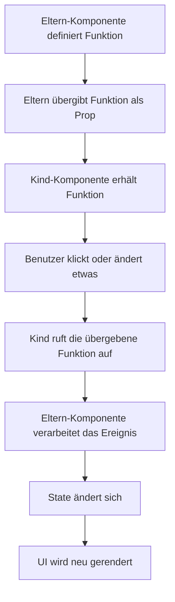
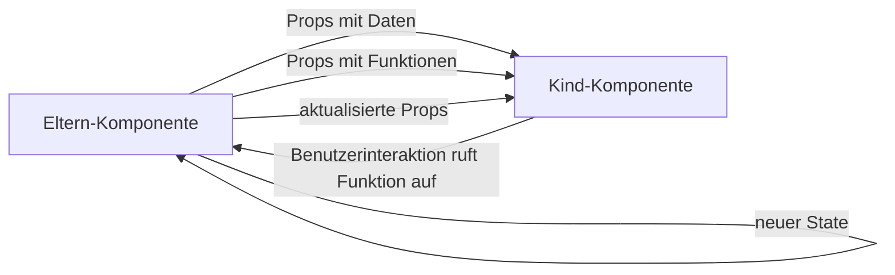

###### Themen

Eventhandling in React

- Einfache Event-Handler für Benutzerinteraktionen (z.B. onClick, onChange)
- Funktionen als Props an Kind-Komponenten weitergeben
- Events auslösen und in übergeordneten Komponenten verarbeiten

Props in React

- Weitergabe von Daten über Props
- Unterschied zwischen statischen und dynamischen Props
- Props lesen und in Komponenten verwenden

# 🖱️ Eventbehandlung in React

In React bedeutet **Eventbehandlung**, dass du auf Benutzerinteraktionen reagierst, also zum Beispiel auf Klicks, Tastatureingaben, Formularänderungen oder das Absenden eines Formulars. React verwendet dafür Attribute wie `onClick`, `onChange`, `onSubmit` oder `onKeyDown`. Diese Schreibweise ist **camelCase** und unterscheidet sich damit von reinem HTML, wo du eher `onclick` oder `onchange` sehen würdest ([Responding to Events](https://react.dev/learn/responding-to-events)).

Ein wichtiges Grundprinzip ist: In React **übergibst du Funktionen als Event-Handler**, statt JavaScript-Code als Text in ein HTML-Attribut zu schreiben. Dadurch bleibt dein Code klar, wartbar und gut testbar. React ruft diese Funktion dann genau dann auf, wenn das Ereignis tatsächlich passiert ([Responding to Events](https://react.dev/learn/responding-to-events)).


<br><br><br>
## 👆 Einfache Event-Handler für Benutzerinteraktionen

Ein einfacher Event-Handler ist eine Funktion, die bei einer bestimmten Benutzeraktion ausgeführt wird. Das häufigste Beispiel ist ein Klick auf einen Button.

```jsx
function App() {
  function handleClick() {
    console.log("Button wurde geklickt");
  }

  return <button onClick={handleClick}>Klick mich</button>;
}
```

Hier passiert Folgendes:

- `handleClick` ist eine ganz normale JavaScript-Funktion.
- `onClick={handleClick}` bedeutet: „Wenn auf den Button geklickt wird, rufe diese Funktion auf.“
- Du **übergibst die Funktion**, du führst sie nicht direkt aus.

Das ist ein sehr wichtiger Unterschied. Diese beiden Varianten sind **nicht** gleich:

```jsx
<button onClick={handleClick}>Richtig</button>
<button onClick={handleClick()}>Falsch in den meisten Fällen</button>
```

Die erste Variante übergibt die Funktion.  
Die zweite Variante führt sie **sofort beim Rendern** aus. Genau deshalb ist sie für normale Event-Handler fast immer falsch ([Responding to Events](https://react.dev/learn/responding-to-events)).


<br><br><br>
### 🧠 Warum man Funktionen übergibt und nicht sofort aufruft

React rendert Komponenten, um die Benutzeroberfläche zu erzeugen. Wenn du in JSX `handleClick()` schreibst, wird die Funktion direkt beim Rendern ausgeführt. Das bedeutet: Der Klick ist dafür gar nicht mehr nötig.

Wenn du dagegen `handleClick` ohne Klammern schreibst, bekommt React nur einen Verweis auf die Funktion. React speichert diesen Verweis und ruft die Funktion erst später auf, wenn das Event wirklich eintritt.

Das ist die Denkweise hinter fast allen React-Events:
- **Jetzt rendern**
- **Später auf Benutzereingaben reagieren**


<br><br><br>
### 🖱️ Häufige Event-Typen in React

Hier siehst du einige der wichtigsten Event-Handler:

| React-Event | Typischer Einsatz | Beispiel |
|---|---|---|
| `onClick` | Klick auf Button, Link, Icon | Button drücken |
| `onChange` | Eingabefelder, Selects, Checkboxen | Text eingeben |
| `onSubmit` | Formulare absenden | Formular speichern |
| `onKeyDown` | Tastendruck erkennen | Enter, Escape |
| `onFocus` | Feld erhält Fokus | Eingabefeld aktiv |
| `onBlur` | Feld verliert Fokus | Validierung nach Verlassen |
| `onMouseEnter` | Maus betritt ein Element | Tooltip anzeigen |
| `onMouseLeave` | Maus verlässt ein Element | Tooltip ausblenden |

React dokumentiert diese Event-Namen direkt auf Basis des DOM-Event-Systems, aber mit der React-typischen JSX-Schreibweise ([Responding to Events](https://react.dev/learn/responding-to-events)).


<br><br><br>
### ⌨️ Beispiel mit `onChange`

`onChange` wird oft bei Formularfeldern verwendet. Damit kannst du auf Eingaben reagieren.

```jsx
import { useState } from "react";

function App() {
  const [name, setName] = useState("");

  function handleChange(event) {
    setName(event.target.value);
  }

  return (
    <>
      <input value={name} onChange={handleChange} />
      <p>Du hast geschrieben: {name}</p>
    </>
  );
}
```

Wichtig ist hier das `event`-Objekt. Es enthält Informationen über das Ereignis. Bei Eingabefeldern ist `event.target.value` besonders wichtig, weil dort der aktuelle Inhalt des Feldes steht ([Responding to Events](https://react.dev/learn/responding-to-events)).

In diesem Beispiel ist das Feld **kontrolliert**: Der sichtbare Wert im Eingabefeld kommt direkt aus dem React-State `name`, und jede Änderung läuft über `setName`. Das ist in React der übliche Weg, Formulare kontrolliert und vorhersehbar zu verwalten ([Managing State](https://react.dev/learn/managing-state)).


<br><br><br>
### 📝 Beispiel mit `onSubmit`

Wenn du ein Formular absendest, solltest du in React meist mit `onSubmit` arbeiten, nicht mit einem `onClick` auf dem Absende-Button. So funktioniert das Formular auch dann korrekt, wenn jemand zum Beispiel Enter drückt.

```jsx
function App() {
  function handleSubmit(event) {
    event.preventDefault();
    console.log("Formular wurde abgesendet");
  }

  return (
    <form onSubmit={handleSubmit}>
      <input placeholder="Dein Name" />
      <button type="submit">Absenden</button>
    </form>
  );
}
```

`event.preventDefault()` verhindert das Standardverhalten des Browsers, also dass die Seite beim Formular-Submit neu geladen oder die Anfrage klassisch abgeschickt wird. Genau dieses Muster zeigt auch die React-Dokumentation ([Responding to Events](https://react.dev/learn/responding-to-events)).


<br><br><br>
### ⚙️ Event-Objekt in React verstehen

Wenn ein Event ausgelöst wird, übergibt React deiner Funktion ein Event-Objekt. Dieses Objekt enthält alle wichtigen Informationen über das Ereignis:

```jsx
function handleClick(event) {
  console.log(event);
}
```

Je nach Event kannst du darüber unterschiedliche Dinge auslesen:

- `event.target` → das Element, das das Event ausgelöst hat
- `event.target.value` → besonders wichtig bei Eingabefeldern
- `event.preventDefault()` → Standardverhalten verhindern
- `event.stopPropagation()` → Weitergabe des Events an übergeordnete Elemente stoppen

React stellt ein einheitliches Event-System bereit, damit Events browserübergreifend konsistent funktionieren ([Responding to Events](https://react.dev/learn/responding-to-events)).

Ein typisches Beispiel für `stopPropagation()`:

```jsx
function App() {
  function handleOuterClick() {
    console.log("Äußeres Element");
  }

  function handleInnerClick(event) {
    event.stopPropagation();
    console.log("Inneres Element");
  }

  return (
    <div onClick={handleOuterClick}>
      <button onClick={handleInnerClick}>Nur inneren Klick ausführen</button>
    </div>
  );
}
```

Ohne `stopPropagation()` würde der Klick auf den Button normalerweise auch das `onClick` des äußeren `div` auslösen, weil Events im DOM nach oben weitergereicht werden. React unterstützt dieses Verhalten ebenfalls ([Responding to Events](https://react.dev/learn/responding-to-events)).


<br><br><br>
### 🧩 Inline-Handler und benannte Handler

Du kannst Event-Handler auf zwei Arten schreiben.

#### Benannte Funktion

```jsx
function App() {
  function handleClick() {
    console.log("Geklickt");
  }

  return <button onClick={handleClick}>Klick</button>;
}
```

#### Inline-Funktion

```jsx
function App() {
  return <button onClick={() => console.log("Geklickt")}>Klick</button>;
}
```

Beides ist erlaubt. Der Unterschied liegt vor allem in der Lesbarkeit:

- **Benannte Funktionen** sind oft besser, wenn die Logik etwas größer wird.
- **Inline-Funktionen** sind praktisch für sehr kurze Aktionen.

Wenn du Parameter übergeben willst, wird eine Inline-Funktion oft nötig:

```jsx
function App() {
  function handleDelete(id) {
    console.log("Lösche Element", id);
  }

  return <button onClick={() => handleDelete(42)}>Löschen</button>;
}
```

Auch hier gilt wieder: `handleDelete(42)` darf nicht direkt beim Rendern ausgeführt werden. Deshalb braucht man die umschließende Pfeilfunktion.


<br><br><br>
## 🔁 Funktionen als Props an Kind-Komponenten weitergeben

In React ist es sehr üblich, dass eine **übergeordnete Komponente** einer **Kind-Komponente** eine Funktion mitgibt. Diese Funktion wird wie jede andere Prop übergeben. Die Kind-Komponente kann sie dann später aufrufen, zum Beispiel bei einem Klick.

Das ist ein zentrales Muster in React, weil Daten in React normalerweise **von oben nach unten** fließen. Die Eltern-Komponente gibt Daten und Verhalten nach unten weiter, und die Kind-Komponente verwendet beides ([Passing Props to a Component](https://react.dev/learn/passing-props-to-a-component)).

Ein einfaches Beispiel:

```jsx
function Button({ onPress, label }) {
  return <button onClick={onPress}>{label}</button>;
}

function App() {
  function handleSave() {
    console.log("Gespeichert");
  }

  return <Button onPress={handleSave} label="Speichern" />;
}
```

Hier passiert etwas sehr Wichtiges:

- `App` besitzt die Funktion `handleSave`.
- `App` übergibt sie als Prop `onPress` an `Button`.
- `Button` bindet `onPress` an sein eigenes `onClick`.
- Wenn der Benutzer klickt, wird letztlich `handleSave` aus `App` ausgeführt.

Das ist keine Magie. Es ist einfach nur das Weiterreichen einer Funktion über Props.


<br><br><br>
### 👨‍👩‍👧 Warum dieses Muster so wichtig ist

Kind-Komponenten sollen oft möglichst **allgemein** und **wiederverwendbar** sein. Ein Button sollte nicht selbst wissen, was „Speichern“, „Löschen“ oder „Abbrechen“ fachlich bedeutet. Er sollte nur wissen: „Wenn jemand klickt, rufe ich die übergebene Funktion auf.“

Dadurch trennst du:

- **Darstellung** in der Kind-Komponente
- **Logik** in der übergeordneten Komponente

Diese Trennung macht React-Code sauber und flexibel. Eine Komponente kann dadurch in verschiedenen Kontexten unterschiedlich verwendet werden, ohne intern geändert werden zu müssen ([Your First Component](https://react.dev/learn/your-first-component)).


<br><br><br>
### 🧱 Beispiel mit mehreren Parametern

Eine Kind-Komponente kann beim Aufruf der übergebenen Funktion auch eigene Daten an die Eltern-Komponente zurückgeben.

```jsx
function ProductCard({ product, onAddToCart }) {
  return (
    <div>
      <h3>{product.name}</h3>
      <button onClick={() => onAddToCart(product.id)}>
        In den Warenkorb
      </button>
    </div>
  );
}

function App() {
  function handleAddToCart(productId) {
    console.log("Produkt hinzugefügt:", productId);
  }

  const product = { id: 7, name: "Tastatur" };

  return (
    <ProductCard product={product} onAddToCart={handleAddToCart} />
  );
}
```

Hier sendet die Kind-Komponente beim Klick die `product.id` nach oben. Das ist in React der typische Weg, wie eine Kind-Komponente „mitteilt“, was passiert ist.


<br><br><br>
### 📛 Warum Props für Funktionen oft mit `on...` beginnen

In React ist es eine sehr verbreitete Konvention, Funktions-Props mit `on` zu benennen, zum Beispiel:

- `onClick`
- `onSubmit`
- `onSave`
- `onDelete`
- `onSelect`

Der Name signalisiert sofort: „Das ist eine Funktion, die auf ein Ereignis reagiert.“ React empfiehlt solche klaren, sprechenden Namen, weil sie Komponenten leichter lesbar machen ([Responding to Events](https://react.dev/learn/responding-to-events)).

Innerhalb der Kind-Komponente ist ebenfalls eine häufige Konvention:

- außen: `onSomething` für die empfangene Prop
- innen: `handleSomething` für die lokale Funktion

Zum Beispiel:

```jsx
function SaveButton({ onSave }) {
  function handleClick() {
    onSave();
  }

  return <button onClick={handleClick}>Speichern</button>;
}
```

Das liest sich sehr natürlich:
- `onSave` kommt von außen
- `handleClick` ist die interne Reaktion


<br><br><br>
## ⬆️ Events auslösen und in übergeordneten Komponenten verarbeiten

In React sagt man oft umgangssprachlich, eine Kind-Komponente „löst ein Event nach oben aus“. Technisch passiert aber etwas etwas anders:

- Die Eltern-Komponente gibt eine Funktion nach unten.
- Die Kind-Komponente ruft diese Funktion auf.
- Dadurch wird die Logik in der Eltern-Komponente ausgeführt.

Das ist wichtig, weil React **keine klassische bidirektionale Kommunikation** zwischen Komponenten verwendet. Stattdessen folgt React dem Prinzip des **einseitigen Datenflusses**: Daten kommen von oben, Reaktionen werden über Callback-Funktionen nach oben gemeldet ([Thinking in React](https://react.dev/learn/thinking-in-react)).

Ein sehr typisches Beispiel:

```jsx
import { useState } from "react";

function CounterButton({ onIncrement }) {
  return <button onClick={onIncrement}>+1</button>;
}

function App() {
  const [count, setCount] = useState(0);

  function handleIncrement() {
    setCount(count + 1);
  }

  return (
    <>
      <p>Aktueller Stand: {count}</p>
      <CounterButton onIncrement={handleIncrement} />
    </>
  );
}
```

Hier gehört der State `count` der Eltern-Komponente `App`. Die Kind-Komponente `CounterButton` verändert den State nicht direkt. Sie ruft nur `onIncrement` auf. Die eigentliche Verarbeitung findet oben statt.

Das ist ein sehr gesundes React-Muster, weil der Zustand dort bleibt, wo er fachlich kontrolliert wird.


<br><br><br>
### 🌊 Datenfluss bei Event-Callbacks

Der typische Ablauf sieht so aus:



Genau dieser Mechanismus ist einer der wichtigsten Bausteine in React: **Interaktion im Kind, Verarbeitung oft im Elternteil, neue Darstellung durch State-Update** ([State: A Component's Memory](https://react.dev/learn/state-a-components-memory)).


<br><br><br>
### 🧮 Beispiel: Kind-Komponente sendet Daten nach oben

```jsx
import { useState } from "react";

function SearchBox({ onSearchChange }) {
  function handleChange(event) {
    onSearchChange(event.target.value);
  }

  return <input onChange={handleChange} placeholder="Suche..." />;
}

function App() {
  const [searchTerm, setSearchTerm] = useState("");

  function handleSearchChange(newValue) {
    setSearchTerm(newValue);
  }

  return (
    <>
      <SearchBox onSearchChange={handleSearchChange} />
      <p>Suchbegriff: {searchTerm}</p>
    </>
  );
}
```

Hier ist gut zu sehen:

- Das Kind kennt den übergeordneten State nicht.
- Das Kind meldet nur die neue Eingabe nach oben.
- Die Eltern-Komponente entscheidet, was mit diesem Wert passiert.

Dieses Muster ist sauber, weil Verantwortlichkeiten klar getrennt bleiben.


<br><br><br>
### 🏗️ „State nach oben verlagern“ als passendes Architekturprinzip

Wenn mehrere Komponenten dieselben Daten benötigen oder wenn eine Eltern-Komponente auf Änderungen aus einer Kind-Komponente reagieren soll, legt man den State oft in die nächsthöhere gemeinsame Komponente. In React nennt man das häufig **lifting state up** ([Sharing State Between Components](https://react.dev/learn/sharing-state-between-components)).

Das passt direkt zum Thema Eventbehandlung:

1. Die Eltern-Komponente besitzt den State.
2. Sie gibt Daten als Props nach unten.
3. Sie gibt zusätzlich Funktionen als Props nach unten.
4. Das Kind ruft diese Funktionen bei Benutzerinteraktionen auf.
5. Die Eltern-Komponente aktualisiert den State.
6. Alle betroffenen Komponenten werden mit den neuen Daten neu gerendert.

Das ist der Grund, warum Event-Handling und Props in React so eng zusammenhängen.


<br><br><br>
### 🚫 Häufige Denkfehler beim Verarbeiten von Events in Eltern-Komponenten

Ein häufiger Fehler ist zu glauben, dass die Kind-Komponente den State der Eltern „einfach ändern“ sollte. In React ist das gerade **nicht** der vorgesehene Weg. Eine Komponente kann den State einer anderen Komponente nicht direkt manipulieren. Stattdessen muss die zuständige Komponente eine Funktion bereitstellen.

Ein weiterer häufiger Fehler ist, Event-Handler sofort aufzurufen:

```jsx
<Child onDelete={handleDelete(id)} />
```

Das ist meistens falsch, weil `handleDelete(id)` beim Rendern ausgeführt wird.

Richtig ist:

```jsx
<Child onDelete={() => handleDelete(id)} />
```

Oder, wenn möglich, delegierst du die Parameterbildung an die Kind-Komponente:

```jsx
function Child({ id, onDelete }) {
  return <button onClick={() => onDelete(id)}>Löschen</button>;
}
```

Dann bleibt die Übergabe oft klarer strukturiert.


<br><br><br>
# 📦 Props in React

**Props** ist die Kurzform für **properties**. Props sind Eingabewerte, die eine Komponente von außen erhält. Du kannst dir Props wie Parameter einer Funktion vorstellen: Die Komponente bekommt Werte übergeben und verwendet sie, um ihre Ausgabe zu erzeugen. Genau so beschreibt React Komponenten: als Funktionen, die Markup auf Basis von Props zurückgeben ([Passing Props to a Component](https://react.dev/learn/passing-props-to-a-component)).

Ein sehr einfaches Beispiel:

```jsx
function Welcome({ name }) {
  return <h1>Hallo, {name}!</h1>;
}

export default function App() {
  return <Welcome name="Mila" />;
}
```

Hier ist `name="Mila"` eine Prop. Die Komponente `Welcome` liest diese Prop und zeigt sie an.

Props sind ein Grundpfeiler von React, weil sie dafür sorgen, dass Komponenten **wiederverwendbar** werden. Dieselbe Komponente kann mit unterschiedlichen Props unterschiedliche Inhalte darstellen.


<br><br><br>
## 📨 Weitergabe von Daten über Props

Props werden immer **von einer Eltern-Komponente an eine Kind-Komponente** übergeben. Das geschieht direkt im JSX über Attribute.

```jsx
function Profile({ name, age }) {
  return (
    <div>
      <h2>{name}</h2>
      <p>Alter: {age}</p>
    </div>
  );
}

function App() {
  return <Profile name="Lea" age={27} />;
}
```

Hier erhält `Profile` zwei Props:

- `name`
- `age`

Innerhalb von `Profile` kannst du diese Werte verwenden, um Inhalte darzustellen.

Wichtig ist: Props sind **read-only**, also nur lesbar. Eine Komponente soll ihre Props nicht verändern. React behandelt Props als unveränderliche Eingaben, damit Komponenten vorhersehbar bleiben ([Passing Props to a Component](https://react.dev/learn/passing-props-to-a-component)).

Das heißt: Wenn sich Werte ändern sollen, dann passiert das normalerweise nicht durch direkte Veränderung einer Prop, sondern durch neuen State oder durch neue Props von oben.


<br><br><br>
### 🧾 Props sind wie Funktionsparameter

Wenn du eine React-Komponente schreibst, sieht sie oft wie eine normale JavaScript-Funktion aus:

```jsx
function Greeting(props) {
  return <h1>Hallo, {props.name}</h1>;
}
```

Hier kommt alles in einem Objekt `props` an. Du kannst dann einzelne Eigenschaften daraus lesen.

Oft verwendet man heute aber **Destructuring**, weil der Code übersichtlicher wird:

```jsx
function Greeting({ name }) {
  return <h1>Hallo, {name}</h1>;
}
```

Beide Varianten funktionieren. Die zweite ist in modernen React-Projekten sehr verbreitet ([Passing Props to a Component](https://react.dev/learn/passing-props-to-a-component)).

Du kannst das so verstehen:

- JSX beim Aufruf: `<Greeting name="Nora" />`
- Übergabewert intern: `{ name: "Nora" }`

Die Komponente bekommt also ein Objekt mit allen Props.


<br><br><br>
### 🧱 Welche Datentypen als Props übergeben werden können

Props können sehr viele verschiedene Datentypen enthalten:

- Strings
- Zahlen
- Booleans
- Arrays
- Objekte
- Funktionen
- JSX
- sogar andere Komponentenstrukturen über `children`

Beispiele:

```jsx
function Example({ title, count, isOpen, items, user, onSave }) {
  return (
    <div>
      <h2>{title}</h2>
      <p>Anzahl: {count}</p>
      <p>Offen: {isOpen ? "Ja" : "Nein"}</p>
      <p>Erster Eintrag: {items[0]}</p>
      <p>Nutzer: {user.name}</p>
      <button onClick={onSave}>Speichern</button>
    </div>
  );
}
```

Aufgerufen zum Beispiel so:

```jsx
<Example
  title="Dashboard"
  count={3}
  isOpen={true}
  items={["A", "B", "C"]}
  user={{ name: "Sam" }}
  onSave={() => console.log("gespeichert")}
/>
```

Dass auch Funktionen als Props erlaubt und üblich sind, verbindet das Thema Props direkt mit dem Event-Handling ([Passing Props to a Component](https://react.dev/learn/passing-props-to-a-component)).


<br><br><br>
## 🔄 Unterschied zwischen statischen und dynamischen Props

Der Unterschied zwischen **statischen** und **dynamischen** Props ist sehr wichtig, weil er zeigt, wie JSX Werte interpretiert.

### 📌 Statische Props

Statische Props sind fest eingetragene Werte, meistens als Text:

```jsx
<Welcome name="Mila" />
```

Hier ist `"Mila"` ein fester String. Solche Props ändern sich nicht von selbst, solange der Code so bleibt.

### ⚡ Dynamische Props

Dynamische Props werden mit geschweiften Klammern `{}` übergeben. In diesen Klammern steht ein JavaScript-Ausdruck:

```jsx
const userName = "Mila";

<Welcome name={userName} />
```

Hier wird nicht der Text `"userName"` übergeben, sondern der aktuelle Wert der Variable `userName`.

Das ist eines der wichtigsten JSX-Prinzipien:  
- ohne `{}` → meist fester Text
- mit `{}` → JavaScript-Ausdruck ([JavaScript in JSX with Curly Braces](https://react.dev/learn/javascript-in-jsx-with-curly-braces))

Eine kompakte Gegenüberstellung:

| Art | Beispiel | Bedeutung |
|---|---|---|
| Statisch | `name="Mila"` | fester String |
| Dynamisch | `name={userName}` | Wert aus Variable |
| Dynamisch | `age={27}` | Zahl |
| Dynamisch | `isAdmin={true}` | Boolean |
| Dynamisch | `items={list}` | Array oder Objekt |
| Dynamisch | `onClick={handleClick}` | Funktion |

Wichtig ist dabei: Auch Zahlen, Booleans, Arrays, Objekte und Funktionen brauchen in JSX normalerweise `{}`, weil sie JavaScript-Werte sind und keine Textliterale ([JavaScript in JSX with Curly Braces](https://react.dev/learn/javascript-in-jsx-with-curly-braces)).


<br><br><br>
### 🔍 Beispiele für statische und dynamische Props

#### Statische Prop

```jsx
<Card title="Willkommen" />
```

Hier ist der Titel immer `"Willkommen"`.

#### Dynamische Prop aus Variable

```jsx
const title = "Willkommen";

<Card title={title} />
```

Hier kommt der Wert aus einer Variable.

#### Dynamische Prop aus Ausdruck

```jsx
<Card title={isLoggedIn ? "Dashboard" : "Bitte einloggen"} />
```

Hier berechnet React den Wert anhand eines Ausdrucks.

#### Dynamische Prop aus State

```jsx
import { useState } from "react";

function App() {
  const [count, setCount] = useState(0);

  return <CounterDisplay count={count} />;
}
```

Hier ändert sich die Prop `count`, sobald sich der State in `App` ändert. Genau deshalb werden Props in React sehr oft dynamisch übergeben.


<br><br><br>
### 🧠 Ein häufiger Stolperstein bei Strings und Ausdrücken

Diese beiden Schreibweisen sehen ähnlich aus, bedeuten aber nicht dasselbe:

```jsx
<Message text="userName" />
<Message text={userName} />
```

- `"userName"` ist einfach nur der feste Text `userName`
- `{userName}` ist der Wert der Variable `userName`

Gerade am Anfang ist das eine der häufigsten Fehlerquellen. JSX wirkt wie HTML, ist aber in Wirklichkeit eine JavaScript-nahe Schreibweise mit eingebetteten Ausdrücken ([JavaScript in JSX with Curly Braces](https://react.dev/learn/javascript-in-jsx-with-curly-braces)).


<br><br><br>
## 📖 Props lesen und in Komponenten verwenden

Eine Komponente kann Props lesen, indem sie sie als Parameter entgegennimmt. Danach kannst du sie überall im JSX verwenden.

Ein klassisches Beispiel:

```jsx
function UserCard({ name, job }) {
  return (
    <div>
      <h2>{name}</h2>
      <p>{job}</p>
    </div>
  );
}
```

Aufruf:

```jsx
<UserCard name="Timo" job="Frontend-Entwickler" />
```

Die Props `name` und `job` werden direkt im JSX angezeigt.

Wichtig ist: Props dienen nicht nur zum Anzeigen von Texten. Du kannst mit ihnen auch Verhalten steuern:

```jsx
function Alert({ isVisible, message }) {
  if (!isVisible) {
    return null;
  }

  return <p>{message}</p>;
}
```

Hier bestimmt die Prop `isVisible`, ob überhaupt etwas gerendert wird. Die Prop `message` liefert den Inhalt.

Das zeigt: Props beeinflussen sowohl **was** eine Komponente anzeigt als auch **ob** und **wie** sie etwas anzeigt.


<br><br><br>
### 🪄 Props mit `props.children`

Eine besondere Prop in React ist `children`. Sie enthält den Inhalt, der zwischen den öffnenden und schließenden Tags einer Komponente steht ([Passing Props to a Component](https://react.dev/learn/passing-props-to-a-component)).

Beispiel:

```jsx
function Panel({ children }) {
  return <section className="panel">{children}</section>;
}

function App() {
  return (
    <Panel>
      <h2>Titel</h2>
      <p>Das ist der Inhalt im Panel.</p>
    </Panel>
  );
}
```

Hier ist alles zwischen `<Panel>` und `</Panel>` in `children` enthalten. Das ist extrem nützlich, um Layout-Komponenten oder Wrapper-Komponenten zu bauen.

Du kannst dir `children` wie einen Platzhalter für verschachtelten JSX-Inhalt vorstellen.


<br><br><br>
### 🧰 Props mit Standardwerten lesen

Manchmal soll eine Komponente auch dann funktionieren, wenn eine bestimmte Prop nicht mitgegeben wird. Dann kannst du Standardwerte im Parameter setzen:

```jsx
function Button({ label = "OK" }) {
  return <button>{label}</button>;
}
```

Wenn du `<Button />` schreibst, wird `label` automatisch `"OK"`.

Wenn du dagegen `<Button label="Speichern" />` schreibst, überschreibt der übergebene Wert den Standardwert.

Das ist ein normales JavaScript-Feature für Funktionsparameter und wird in React sehr häufig genutzt.


<br><br><br>
### 🪜 Komplexere Props sauber verwenden

Bei einfachen Props wie `name` oder `age` ist alles direkt verständlich. Bei komplexeren Daten wie Objekten solltest du sorgfältig lesen, was tatsächlich übergeben wird.

```jsx
function UserProfile({ user }) {
  return (
    <div>
      <h2>{user.name}</h2>
      <p>{user.email}</p>
    </div>
  );
}

function App() {
  const user = {
    name: "Lina",
    email: "lina@example.com"
  };

  return <UserProfile user={user} />;
}
```

Hier ist `user` selbst eine einzelne Prop, aber ihr Wert ist ein Objekt. In der Komponente greifst du dann über `user.name` oder `user.email` darauf zu.

Wenn du möchtest, kannst du auch verschachtelt destrukturieren:

```jsx
function UserProfile({ user: { name, email } }) {
  return (
    <div>
      <h2>{name}</h2>
      <p>{email}</p>
    </div>
  );
}
```

Das funktioniert, ist aber für Einsteiger oft schwerer lesbar. Darum ist die erste Variante in vielen Fällen klarer.


<br><br><br>
### 🔒 Warum Props nicht verändert werden sollen

Props werden von außen an eine Komponente übergeben. Deshalb sollte die empfangende Komponente sie als **unveränderliche Eingabe** behandeln. React beschreibt Komponenten als „reine“ Funktionen im Sinne von: gleiche Props, gleiche Ausgabe ([Keeping Components Pure](https://react.dev/learn/keeping-components-pure)).

Ein problematisches Beispiel wäre:

```jsx
function Discount({ price }) {
  price = price - 10;
  return <p>{price}</p>;
}
```

Zwar funktioniert das technisch im lokalen Scope, aber es ist konzeptionell unsauber, weil du eine Eingabe veränderst. Besser ist:

```jsx
function Discount({ price }) {
  const discountedPrice = price - 10;
  return <p>{discountedPrice}</p>;
}
```

So bleibt klar:
- `price` ist die Eingabe
- `discountedPrice` ist der daraus berechnete Wert

Diese Denkweise hilft enorm dabei, React-Komponenten verständlich und zuverlässig zu halten.


<br><br><br>
### 🔗 Wie Props und Event-Handling zusammenhängen

Gerade in React greifen diese beiden Themen direkt ineinander:

- **Daten** werden über Props nach unten gereicht.
- **Funktionen** werden ebenfalls über Props nach unten gereicht.
- Die Kind-Komponente nutzt die Daten zum Anzeigen.
- Die Kind-Komponente nutzt die Funktions-Props, um auf Benutzeraktionen zu reagieren.
- Die Eltern-Komponente verarbeitet das Ereignis und gibt anschließend eventuell neue Props weiter.

Das kann man so darstellen:



Genau deshalb sollte man Props nicht nur als „Datencontainer“ sehen. Props transportieren in React sowohl **Werte** als auch **Verhalten** ([Passing Props to a Component](https://react.dev/learn/passing-props-to-a-component)).

Ein kleines Gesamtbeispiel macht das besonders deutlich:

```jsx
import { useState } from "react";

function NameInput({ value, onChangeName }) {
  return (
    <input
      value={value}
      onChange={(event) => onChangeName(event.target.value)}
    />
  );
}

function App() {
  const [name, setName] = useState("");

  return (
    <>
      <NameInput value={name} onChangeName={setName} />
      <p>Hallo, {name || "Unbekannt"}!</p>
    </>
  );
}
```

Hier wird beides kombiniert:

- `value={name}` ist eine Daten-Prop
- `onChangeName={setName}` ist eine Funktions-Prop
- Das Kind liest die Props
- Das Kind verarbeitet das Eingabe-Event
- Die Eltern-Komponente hält den State und aktualisiert die Oberfläche

Das ist eines der typischsten und wichtigsten Muster in React 19.