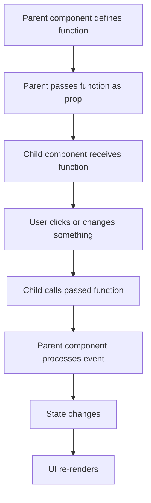
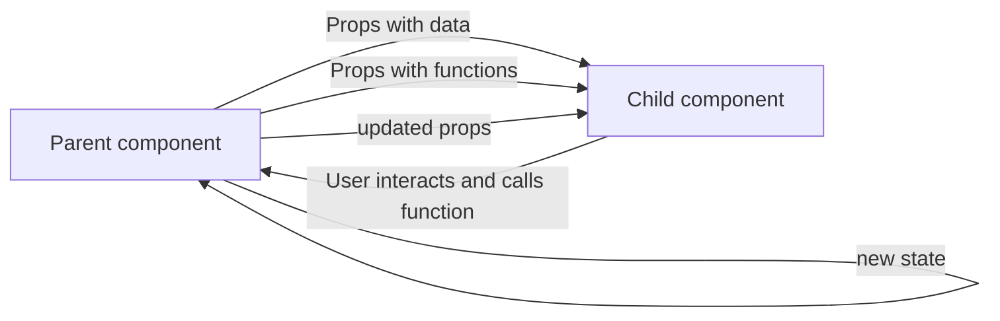

###### Topics

Event Handling in React

- Simple event handlers for user interactions (e.g., onClick, onChange)
- Passing functions as props to child components
- Triggering events and handling them in parent components

Props in React

- Passing data via props
- Difference between static and dynamic props
- Reading and using props in components

# 🖱️ Event Handling in React

In React, **event handling** means responding to user interactions, such as clicks, keyboard input, form changes, or form submissions. React uses attributes like `onClick`, `onChange`, `onSubmit`, or `onKeyDown` for this. These are written in **camelCase** and thus differ from plain HTML, where you might see `onclick` or `onchange` ([Responding to Events](https://react.dev/learn/responding-to-events)).

An important principle is: In React, **you pass functions as event handlers** instead of writing JavaScript code as a string into an HTML attribute. This keeps your code clear, maintainable, and easily testable. React then calls this function exactly when the event happens ([Responding to Events](https://react.dev/learn/responding-to-events)).


<br><br><br>
## 👆 Simple Event Handlers for User Interactions

A simple event handler is a function that is executed on a specific user action. The most common example is a button click.

```jsx
function App() {
  function handleClick() {
    console.log("Button was clicked");
  }

  return <button onClick={handleClick}>Click me</button>;
}
```

What's happening here:

- `handleClick` is a plain JavaScript function.
- `onClick={handleClick}` means: "When the button is clicked, call this function."
- You **pass the function**, you don't execute it directly.

This is a very important distinction. These two options are **not** the same:

```jsx
<button onClick={handleClick}>Correct</button>
<button onClick={handleClick()}>Usually wrong</button>
```

The first option passes the function.  
The second option **executes it immediately at render time**. That's why it's almost always wrong for standard event handlers ([Responding to Events](https://react.dev/learn/responding-to-events)).


<br><br><br>
### 🧠 Why You Pass Functions Instead of Calling Them Immediately

React renders components to generate the UI. If you write `handleClick()` in JSX, the function is called immediately during rendering. That means: the click is not needed for it to run.

If you write `handleClick` without parentheses, React just receives a reference to the function. React stores this reference and calls the function later when the event actually happens.

That's the mindset behind almost all React events:
- **Render now**
- **React to user input later**


<br><br><br>
### 🖱️ Common Event Types in React

Here are some of the most important event handlers:

| React Event     | Typical Use Case            | Example                |
|---|---|---|
| `onClick`       | Button, link, icon clicks  | Pressing a button      |
| `onChange`      | Inputs, selects, checkboxes| Typing text            |
| `onSubmit`      | Submitting a form          | Saving a form          |
| `onKeyDown`     | Key presses                | Enter, Escape          |
| `onFocus`       | Field gains focus          | Input field is active  |
| `onBlur`        | Field loses focus          | Validation on blur     |
| `onMouseEnter`  | Mouse enters element       | Show tooltip           |
| `onMouseLeave`  | Mouse leaves element       | Hide tooltip           |

React documents these event names directly based on the DOM event system, but with the React-style JSX syntax ([Responding to Events](https://react.dev/learn/responding-to-events)).


<br><br><br>
### ⌨️ Example with `onChange`

`onChange` is often used with form fields. It lets you react to user input.

```jsx
import { useState } from "react";

function App() {
  const [name, setName] = useState("");

  function handleChange(event) {
    setName(event.target.value);
  }

  return (
    <>
      <input value={name} onChange={handleChange} />
      <p>You wrote: {name}</p>
    </>
  );
}
```

The important thing here is the `event` object. It contains information about the event. For input fields, `event.target.value` is especially important, as it holds the current field content ([Responding to Events](https://react.dev/learn/responding-to-events)).

In this example, the field is **controlled**: the visible value in the input comes directly from the React state `name`, and every change goes through `setName`. This is the usual React way to manage forms in a controlled and predictable way ([Managing State](https://react.dev/learn/managing-state)).


<br><br><br>
### 📝 Example with `onSubmit`

When you submit a form, you should mostly use `onSubmit` in React, not an `onClick` on the submit button. That way, the form also works correctly if someone presses Enter.

```jsx
function App() {
  function handleSubmit(event) {
    event.preventDefault();
    console.log("Form was submitted");
  }

  return (
    <form onSubmit={handleSubmit}>
      <input placeholder="Your name" />
      <button type="submit">Submit</button>
    </form>
  );
}
```

`event.preventDefault()` prevents the browser's default behavior, so the page doesn't reload or send the request in the classic way. This pattern is also shown in the React docs ([Responding to Events](https://react.dev/learn/responding-to-events)).


<br><br><br>
### ⚙️ Understanding the Event Object in React

When an event is triggered, React passes your function an event object. This object contains all important information about the event:

```jsx
function handleClick(event) {
  console.log(event);
}
```

Depending on the event, you can read various properties:

- `event.target` → The element that triggered the event
- `event.target.value` → Especially for input fields
- `event.preventDefault()` → Prevent default behavior
- `event.stopPropagation()` → Stop the event from bubbling up

React provides a unified event system so events work consistently across browsers ([Responding to Events](https://react.dev/learn/responding-to-events)).

A typical example for `stopPropagation()`:

```jsx
function App() {
  function handleOuterClick() {
    console.log("Outer element");
  }

  function handleInnerClick(event) {
    event.stopPropagation();
    console.log("Inner element");
  }

  return (
    <div onClick={handleOuterClick}>
      <button onClick={handleInnerClick}>Only run inner click</button>
    </div>
  );
}
```

Without `stopPropagation()`, clicking the button would also trigger the outer `div`'s `onClick`, because events bubble up the DOM. React also supports this behavior ([Responding to Events](https://react.dev/learn/responding-to-events)).


<br><br><br>
### 🧩 Inline Handlers and Named Handlers

You can write event handlers in two ways.

#### Named Function

```jsx
function App() {
  function handleClick() {
    console.log("Clicked");
  }

  return <button onClick={handleClick}>Click</button>;
}
```

#### Inline Function

```jsx
function App() {
  return <button onClick={() => console.log("Clicked")}>Click</button>;
}
```

Both are allowed. The difference is mainly about readability:

- **Named functions** are better if the logic grows.
- **Inline functions** are handy for very short actions.

If you want to pass parameters, you'll often need an inline function:

```jsx
function App() {
  function handleDelete(id) {
    console.log("Delete item", id);
  }

  return <button onClick={() => handleDelete(42)}>Delete</button>;
}
```

Again: `handleDelete(42)` mustn't be called immediately during rendering. That's why you need the surrounding arrow function.


<br><br><br>
## 🔁 Passing Functions as Props to Child Components

In React, it's very common for a **parent component** to pass a function to a **child component**. This function is passed as a prop like any other. The child can call it later, for example on a click.

This is a central React pattern, because in React data usually **flows from top to bottom**. The parent passes data and behavior down, and the child uses both ([Passing Props to a Component](https://react.dev/learn/passing-props-to-a-component)).

A simple example:

```jsx
function Button({ onPress, label }) {
  return <button onClick={onPress}>{label}</button>;
}

function App() {
  function handleSave() {
    console.log("Saved");
  }

  return <Button onPress={handleSave} label="Save" />;
}
```

Here something very important is happening:

- `App` has the function `handleSave`.
- `App` passes it as the `onPress` prop to `Button`.
- `Button` binds `onPress` to its own `onClick`.
- When the user clicks, `handleSave` from `App` is ultimately executed.

There's no magic. It's just passing a function via props.


<br><br><br>
### 👨‍👩‍👧 Why This Pattern Is So Important

Child components are often meant to be as **generic** and **reusable** as possible. A button shouldn't know what "save", "delete", or "cancel" means in business terms. It should simply know: "When someone clicks, I call the given function."

This lets you separate:

- **Presentation** in the child component
- **Logic** in the parent component

This separation makes React code clean and flexible. A component can thus be used differently in different contexts, without internal changes ([Your First Component](https://react.dev/learn/your-first-component)).


<br><br><br>
### 🧱 Example with Multiple Parameters

A child component can also send its own data back to the parent when calling the function.

```jsx
function ProductCard({ product, onAddToCart }) {
  return (
    <div>
      <h3>{product.name}</h3>
      <button onClick={() => onAddToCart(product.id)}>
        Add to cart
      </button>
    </div>
  );
}

function App() {
  function handleAddToCart(productId) {
    console.log("Product added:", productId);
  }

  const product = { id: 7, name: "Keyboard" };

  return (
    <ProductCard product={product} onAddToCart={handleAddToCart} />
  );
}
```

Here, the child component sends `product.id` up to the parent when the button is clicked. This is the typical React way for a child to "notify" what happened.


<br><br><br>
### 📛 Why Function Props Often Start with `on...`

In React, it's a very common convention to name function props with `on`, for example:

- `onClick`
- `onSubmit`
- `onSave`
- `onDelete`
- `onSelect`

The name immediately signals: "This is a function responding to an event." React recommends such clear, descriptive names as they make components easier to read ([Responding to Events](https://react.dev/learn/responding-to-events)).

Within child components, it's also common:

- outside: `onSomething` for the received prop
- inside: `handleSomething` for the local function

For example:

```jsx
function SaveButton({ onSave }) {
  function handleClick() {
    onSave();
  }

  return <button onClick={handleClick}>Save</button>;
}
```

This reads very naturally:
- `onSave` comes from outside
- `handleClick` is the internal reaction


<br><br><br>
## ⬆️ Triggering Events and Handling Them in Parent Components

In React you often hear people say a child component "raises an event up." Technically, something slightly different happens:

- The parent component passes a function down.
- The child component calls this function.
- This causes the logic in the parent to run.

This is important because React **doesn't use classic two-way communication** between components. Instead, React follows **one-way data flow**: Data comes from above, reactions are reported upward via callback functions ([Thinking in React](https://react.dev/learn/thinking-in-react)).

A typical example:

```jsx
import { useState } from "react";

function CounterButton({ onIncrement }) {
  return <button onClick={onIncrement}>+1</button>;
}

function App() {
  const [count, setCount] = useState(0);

  function handleIncrement() {
    setCount(count + 1);
  }

  return (
    <>
      <p>Current count: {count}</p>
      <CounterButton onIncrement={handleIncrement} />
    </>
  );
}
```

Here, the `count` state belongs to the parent `App`. The child `CounterButton` doesn't change the state directly. It just calls `onIncrement`. Processing happens at the top.

This is a very healthy React pattern because state stays where it is logically controlled.


<br><br><br>
### 🌊 Data Flow with Event Callbacks

The typical flow looks like this:



This is one of the most important building blocks in React: **Interaction in the child, processing usually in the parent, new rendering through state updates** ([State: A Component's Memory](https://react.dev/learn/state-a-components-memory)).


<br><br><br>
### 🧮 Example: Child Component Sends Data Upwards

```jsx
import { useState } from "react";

function SearchBox({ onSearchChange }) {
  function handleChange(event) {
    onSearchChange(event.target.value);
  }

  return <input onChange={handleChange} placeholder="Search..." />;
}

function App() {
  const [searchTerm, setSearchTerm] = useState("");

  function handleSearchChange(newValue) {
    setSearchTerm(newValue);
  }

  return (
    <>
      <SearchBox onSearchChange={handleSearchChange} />
      <p>Search term: {searchTerm}</p>
    </>
  );
}
```

Here you can see:

- The child doesn't know the parent's state.
- The child just reports the new input value upward.
- The parent decides what to do with the value.

This pattern is clean because responsibilities stay clearly separated.


<br><br><br>
### 🏗️ “Lifting State Up” as an Architectural Principle

If several components need the same data, or if a parent needs to react to changes from a child, you often put state in the next common parent. In React, this is called **lifting state up** ([Sharing State Between Components](https://react.dev/learn/sharing-state-between-components)).

This ties directly into event handling:

1. The parent component has the state.
2. It passes data as props downward.
3. It also passes functions as props downward.
4. The child calls these functions for user interactions.
5. The parent updates the state.
6. All affected components re-render with the new data.

That's why event handling and props are so closely connected in React.


<br><br><br>
### 🚫 Common Pitfalls When Handling Events in Parent Components

A common mistake is to think the child "should just change" the parent's state. In React, this is **not** the intended way. A component cannot directly mutate another's state. Instead, the responsible component must provide a function.

Another common error is calling event handlers immediately:

```jsx
<Child onDelete={handleDelete(id)} />
```

This is usually wrong because `handleDelete(id)` is run at render time.

The correct way:

```jsx
<Child onDelete={() => handleDelete(id)} />
```

Or, if possible, delegate the parameter creation to the child:

```jsx
function Child({ id, onDelete }) {
  return <button onClick={() => onDelete(id)}>Delete</button>;
}
```

This often keeps the prop structure clearer.


<br><br><br>
# 📦 Props in React

**Props** is short for **properties**. Props are input values that a component receives from outside. You can think of props as function parameters: the component is given values and uses them to generate its output. React describes components exactly like this: as functions that return markup based on props ([Passing Props to a Component](https://react.dev/learn/passing-props-to-a-component)).

A very simple example:

```jsx
function Welcome({ name }) {
  return <h1>Hello, {name}!</h1>;
}

export default function App() {
  return <Welcome name="Mila" />;
}
```

Here, `name="Mila"` is a prop. The `Welcome` component reads the prop and displays it.

Props are a cornerstone of React because they make components **reusable**. The same component can show different content with different props.


<br><br><br>
## 📨 Passing Data via Props

Props are always **passed from a parent component to a child component**. This is done directly in JSX as attributes.

```jsx
function Profile({ name, age }) {
  return (
    <div>
      <h2>{name}</h2>
      <p>Age: {age}</p>
    </div>
  );
}

function App() {
  return <Profile name="Lea" age={27} />;
}
```

Here, `Profile` receives two props:

- `name`
- `age`

Inside `Profile`, you can use those values to display content.

Note: Props are **read-only**. A component should not change its props. React treats props as immutable input to keep components predictable ([Passing Props to a Component](https://react.dev/learn/passing-props-to-a-component)).

So: if values should change, that does not happen by changing a prop directly, but via state or by passing new props down.


<br><br><br>
### 🧾 Props Are Like Function Parameters

Writing a React component often looks like a regular JavaScript function:

```jsx
function Greeting(props) {
  return <h1>Hello, {props.name}</h1>;
}
```

Everything comes in a `props` object. You can read individual properties from it.

Nowadays, you'll often use **destructuring**, as this is more concise:

```jsx
function Greeting({ name }) {
  return <h1>Hello, {name}</h1>;
}
```

Both work. The second is very common in modern React ([Passing Props to a Component](https://react.dev/learn/passing-props-to-a-component)).

You can think of it as:

- JSX at call time: `<Greeting name="Nora" />`
- Internal argument: `{ name: "Nora" }`

The component gets an object with all its props.


<br><br><br>
### 🧱 What Data Types Can Be Passed as Props

Props can be a wide range of data types:

- Strings
- Numbers
- Booleans
- Arrays
- Objects
- Functions
- JSX
- even nested component structures via `children`

Examples:

```jsx
function Example({ title, count, isOpen, items, user, onSave }) {
  return (
    <div>
      <h2>{title}</h2>
      <p>Count: {count}</p>
      <p>Open: {isOpen ? "Yes" : "No"}</p>
      <p>First item: {items[0]}</p>
      <p>User: {user.name}</p>
      <button onClick={onSave}>Save</button>
    </div>
  );
}
```

Usage, for example:

```jsx
<Example
  title="Dashboard"
  count={3}
  isOpen={true}
  items={["A", "B", "C"]}
  user={{ name: "Sam" }}
  onSave={() => console.log("saved")}
/>
```

That functions can also be passed as props is directly what links props to event handling ([Passing Props to a Component](https://react.dev/learn/passing-props-to-a-component)).


<br><br><br>
## 🔄 Difference Between Static and Dynamic Props

The difference between **static** and **dynamic** props is very important because it shows how JSX interprets values.

### 📌 Static Props

Static props are fixed values, usually as text:

```jsx
<Welcome name="Mila" />
```

Here, `"Mila"` is a fixed string. These props don't change themselves.

### ⚡ Dynamic Props

Dynamic props are passed with curly braces `{}`. Inside the braces is a JavaScript expression:

```jsx
const userName = "Mila";

<Welcome name={userName} />
```

Here, it's not the string `"userName"` but the current value of the variable `userName`.

This is one of the most important JSX principles:  
- Without `{}` → usually fixed text
- With `{}` → JavaScript expression ([JavaScript in JSX with Curly Braces](https://react.dev/learn/javascript-in-jsx-with-curly-braces))

A quick comparison:

| Type     | Example           | Meaning         |
|----------|-------------------|----------------|
| Static   | `name="Mila"`     | fixed string   |
| Dynamic  | `name={userName}` | value from variable|
| Dynamic  | `age={27}`        | number         |
| Dynamic  | `isAdmin={true}`  | boolean        |
| Dynamic  | `items={list}`    | array or object|
| Dynamic  | `onClick={handleClick}` | function |

Also note: Numbers, booleans, arrays, objects, and functions normally need `{}` in JSX because they're JavaScript values, not text literals ([JavaScript in JSX with Curly Braces](https://react.dev/learn/javascript-in-jsx-with-curly-braces)).


<br><br><br>
### 🔍 Examples of Static and Dynamic Props

#### Static Prop

```jsx
<Card title="Welcome" />
```

Here, the title is always `"Welcome"`.

#### Dynamic Prop from Variable

```jsx
const title = "Welcome";

<Card title={title} />
```

Here, the value comes from a variable.

#### Dynamic Prop from Expression

```jsx
<Card title={isLoggedIn ? "Dashboard" : "Please log in"} />
```

React calculates the value depending on the expression.

#### Dynamic Prop from State

```jsx
import { useState } from "react";

function App() {
  const [count, setCount] = useState(0);

  return <CounterDisplay count={count} />;
}
```

Here, the `count` prop changes whenever the `App` state changes. This is why props in React are often passed dynamically.


<br><br><br>
### 🧠 A Common Pitfall with Strings and Expressions

These two syntaxes look similar but mean different things:

```jsx
<Message text="userName" />
<Message text={userName} />
```

- `"userName"` is just the literal text `userName`
- `{userName}` is the value of the variable `userName`

At the beginning, this is one of the most common sources of mistakes. JSX looks like HTML but is really a JavaScript-like syntax with embedded expressions ([JavaScript in JSX with Curly Braces](https://react.dev/learn/javascript-in-jsx-with-curly-braces)).


<br><br><br>
## 📖 Reading Props and Using Them in Components

A component can read props by accepting them as parameters. You can then use them anywhere in your JSX.

A classic example:

```jsx
function UserCard({ name, job }) {
  return (
    <div>
      <h2>{name}</h2>
      <p>{job}</p>
    </div>
  );
}
```

Usage:

```jsx
<UserCard name="Timo" job="Frontend Developer" />
```

The `name` and `job` props are displayed directly in the JSX.

Note: Props are not just for displaying text. You can also control behavior with them:

```jsx
function Alert({ isVisible, message }) {
  if (!isVisible) {
    return null;
  }

  return <p>{message}</p>;
}
```

Here, the `isVisible` prop determines whether anything is rendered. The `message` prop provides the content.

This shows: Props affect both **what** a component displays and **whether**/**how** it displays something.


<br><br><br>
### 🪄 Props with `props.children`

A special prop in React is `children`. It contains whatever is between a component's opening and closing tags ([Passing Props to a Component](https://react.dev/learn/passing-props-to-a-component)).

Example:

```jsx
function Panel({ children }) {
  return <section className="panel">{children}</section>;
}

function App() {
  return (
    <Panel>
      <h2>Title</h2>
      <p>This is the content inside the panel.</p>
    </Panel>
  );
}
```

Here, everything between `<Panel>` and `</Panel>` is in `children`. This is extremely useful for building layout or wrapper components.

You can think of `children` as a placeholder for nested JSX content.


<br><br><br>
### 🧰 Reading Props with Default Values

Sometimes you want a component to work even if a certain prop wasn't provided. You can set default values in the parameter list:

```jsx
function Button({ label = "OK" }) {
  return <button>{label}</button>;
}
```

If you write `<Button />`, `label` is automatically `"OK"`.

If you write `<Button label="Save" />`, the passed value overrides the default.

This is a regular JavaScript feature for function parameters and is used often in React.


<br><br><br>
### 🪜 Using More Complex Props Cleanly

For simple props like `name` or `age`, everything's straightforward. For more complex data like objects, be careful to read what is actually being passed.

```jsx
function UserProfile({ user }) {
  return (
    <div>
      <h2>{user.name}</h2>
      <p>{user.email}</p>
    </div>
  );
}

function App() {
  const user = {
    name: "Lina",
    email: "lina@example.com"
  };

  return <UserProfile user={user} />;
}
```

Here, `user` is a single prop, but its value is an object. In the component, you access `user.name` or `user.email`.

If you want, you can also destructure nested props:

```jsx
function UserProfile({ user: { name, email } }) {
  return (
    <div>
      <h2>{name}</h2>
      <p>{email}</p>
    </div>
  );
}
```

This works, but is often harder to read for beginners. The first version is often clearer.


<br><br><br>
### 🔒 Why You Shouldn't Change Props

Props are passed from outside to a component. Therefore, the receiving component should treat them as **immutable input**. React describes components as "pure" functions: same props, same output ([Keeping Components Pure](https://react.dev/learn/keeping-components-pure)).

A problematic example:

```jsx
function Discount({ price }) {
  price = price - 10;
  return <p>{price}</p>;
}
```

Technically this works locally, but conceptually it's not clean, because you're changing an input. Better is:

```jsx
function Discount({ price }) {
  const discountedPrice = price - 10;
  return <p>{discountedPrice}</p>;
}
```

This keeps things clear:
- `price` is the input
- `discountedPrice` is the computed value

This mindset is key to keeping React components understandable and reliable.


<br><br><br>
### 🔗 How Props and Event Handling Are Connected

Especially in React, these two topics are closely intertwined:

- **Data** is passed down as props.
- **Functions** are also passed down as props.
- The child component uses data props to display.
- The child uses function props to respond to user actions.
- The parent processes the event and possibly sends new props down.

This can be visualized as:



That's why you shouldn't just see props as "data containers." Props in React carry both **data** and **behavior** ([Passing Props to a Component](https://react.dev/learn/passing-props-to-a-component)).

A small overall example makes this particularly clear:

```jsx
import { useState } from "react";

function NameInput({ value, onChangeName }) {
  return (
    <input
      value={value}
      onChange={(event) => onChangeName(event.target.value)}
    />
  );
}

function App() {
  const [name, setName] = useState("");

  return (
    <>
      <NameInput value={name} onChangeName={setName} />
      <p>Hello, {name || "Unknown"}!</p>
    </>
  );
}
```

Here both are combined:

- `value={name}` is a data prop
- `onChangeName={setName}` is a function prop
- The child reads the props
- The child handles the input event
- The parent holds the state and updates the UI

This is one of the most typical and important patterns in React 19.